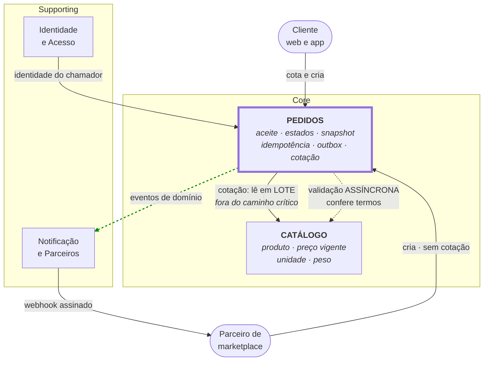

# Mapa de Domínios — Pedidos e Catálogo

**Slug do PRD:** pedidos-catalogo
**Escopo deste documento:** bounded contexts, ownership de dados e relacionamentos. O escopo é **exatamente o que o enunciado nomeia**: Pedidos e Catálogo, mais as capacidades que §2.2.1 exige (parceiros e identidade). A topologia de execução está em `docs/technical-context/architecture.md`.
**Requisitos cobertos:** `P1-09`, `P1-10`
**Fontes:** `docs/prd/pedidos-catalogo.md`, `docs/technical-context/constraints.md`, `ADR-0003`, `ADR-0004`, `ADR-0007`
**Data:** 2026-09-23 *(recorte revisto: contextos não presentes no enunciado foram removidos)*

---

## A linha de corte

O desafio descreve uma *"plataforma de **Pedidos e Catálogo**"*. O mapa contém exatamente isso, por uma regra simples:

> Entra no mapa o que o enunciado nomeia. Fica fora o que seria preciso **inventar** para que a solução parecesse completa.

Estoque, Pagamento e Carrinho são os candidatos naturais num desenho de e-commerce, e **nenhum deles é nomeado**. Incluí-los exigiria assumir que existem, com que contrato e com que disponibilidade — três premissas inventadas sustentando a parte mais sensível do desenho. Pior: a onda 30 passaria a depender delas para caber em 30 dias. `AV-08` avalia exatamente isso — não superdimensionar.

A decisão central não depende deles. O argumento da `ADR-0007` — dependência síncrona no caminho crítico torna `CTX-03` inatingível — depende de **haver** dependência síncrona, e o Catálogo cumpre esse papel.

---

## 1. Contextos

### Core

**Pedidos** · *o núcleo do problema*
Aceita, valida e acompanha o ciclo de vida do pedido. Dono da máquina de estados, do snapshot dos termos, da chave de idempotência e do outbox.

Inclui a capacidade de **cotação**: `POST /v2/quotes` lê o Catálogo e devolve os termos assinados com validade. Ela é de Pedidos, não de um contexto separado — existe para tirar a leitura do Catálogo do caminho crítico, e quem a emite é quem precisa do resultado.

**Ownership:** `pedido`, `pedido_item`, `snapshot de termos`, `cotacao`, `idempotency_key`, `outbox`, `transicao_estado`.
**Não é dono de:** preço vigente, catálogo de produtos.

**Catálogo** · *a fonte dos termos*
Produto, preço vigente, descrição, unidade de medida, peso e dimensões. Upstream de Pedidos.

**Ownership:** `produto`, `preco_vigente`, `atributo`.

### Supporting — exigidos por §2.2.1

**Notificação e Parceiros** — entrega assíncrona de mudança de status, com assinatura, retry e DLQ.
Existe porque `CTX-08` o exige: *"Parceiros solicitam API pública versionada e notificações assíncronas de mudança de status"*.
**Ownership:** `assinatura_webhook`, `tentativa_entrega`, `dlq`.

**Identidade e Acesso** — autenticação de cliente e de parceiro, escopos, quotas por parceiro.
Existe porque `P1-16` exige autenticação, autorização e quotas na API pública, e porque o threat model (F1.5, F3.2) mostrou que a identidade do chamador precisa vir da borda, nunca de header do cliente.
**Ownership:** `credencial_parceiro`, `escopo`, `quota`, `preferencia_privacidade`.

### Explicitamente fora

| Fora do mapa | Por quê |
|---|---|
| **Estoque** | Não citado no enunciado. Incluí-lo era inventar escopo |
| **Pagamento** | Idem |
| **Carrinho** | A cotação resolve o que ele resolveria, dentro de Pedidos |
| **Fiscal e logística** | Escopo OUT nº 3 do PRD |

Nenhum deles é negado como realidade — uma plataforma de varejo tem todos. Eles estão fora **deste desenho**, porque o desafio não os apresenta e porque assumi-los criaria dependência de prazo sobre integrações cuja existência ninguém confirmou.

---

## 2. Context map

| De → Para | Padrão | Por quê |
|---|---|---|
| Pedidos → Catálogo *(cotação)* | **Customer/Supplier + ACL** | Catálogo tem modelo rico e ciclo próprio; a ACL traduz produto em termos cotáveis. Acontece **antes** da criação, fora do caminho crítico |
| Pedidos → Catálogo *(validação)* | **Customer/Supplier, assíncrono** | `ADR-0007`: conferir os termos submetidos não bloqueia o aceite |
| Pedidos → Notificação | **Open Host Service** | Pedidos publica eventos de domínio versionados; consumidores se inscrevem sem que Pedidos os conheça |
| Identidade → Pedidos | **Conformist** | Pedidos consome a identidade que a borda estabelece. Não negocia o modelo, e **não aceita identidade vinda do cliente** (F3.2) |
| Parceiro → Pedidos | **Open Host Service + Published Language** | OpenAPI e AsyncAPI versionadas (`CTX-08`). Fronteira de confiança: conteúdo do parceiro é **não confiável** |

**A assimetria entre canais é deliberada.** Canal próprio cota antes e tem os termos assinados; parceiro submete os termos do sistema dele e é conferido depois. A consequência — rejeição pós-aceite estruturalmente maior no canal de parceiro — é comportamento esperado do modelo, registrado na `ADR-0007`.

---

## 3. Ownership de dados — quem pode escrever

| Dado | Dono | Quem lê | Regra |
|---|---|---|---|
| `preco_vigente`, `produto` | Catálogo | Pedidos (na cotação) | Ninguém além do Catálogo escreve |
| `cotacao` (termos + validade + assinatura) | Pedidos | Pedidos | Imutável após emissão; expira por tempo |
| `snapshot` no item do pedido | Pedidos | todos | **Imutável para sempre.** Cópia dos termos, não referência |
| `estado do pedido` | Pedidos | todos | Só Pedidos transiciona; transição inválida é recusada pelo domínio |
| `outbox` | Pedidos | relay | Escrito na **mesma transação** do pedido |
| `preferencia_privacidade` | Identidade | todos os consumidores de dado | `CTX-09d`: precisa ser honrada por toda a cadeia |

**A regra que sustenta o desenho:** o pedido é **autocontido** no que diz respeito a termos acordados. Nenhuma leitura de pedido depende de outro contexto — verificado pelo teste que consulta o pedido com o Catálogo fora do ar.

---

## 4. Integração síncrona × assíncrona (`P1-10`)

| Integração | Modo | Consistência | Justificativa |
|---|---|---|---|
| Pedidos → Catálogo (cotação) | **síncrona** | forte no instante da cotação | O cliente precisa ver preço agora. Fora do caminho crítico de criação, então não afeta `CTX-04` nem `CTX-17` |
| Canal → Pedidos (aceite) | **síncrona, porém local** | forte, sem dependência externa | É o caminho crítico. Zero chamada de saída (`ADR-0007`) |
| Pedidos → Catálogo (validação) | **assíncrona** | eventual | Trocar acoplamento por tempo: o pedido existe antes de ser confirmado |
| Pedidos → consumidores de evento | **assíncrona** | eventual, at-least-once | `CTX-08`. Consumidor deduplica por `event_id` |
| Notificação → Parceiro (webhook) | **assíncrona** | at-least-once, com retry e DLQ | Parceiro é externo e indisponível com frequência; a entrega precisa sobreviver a isso |

**Critério aplicado:** síncrono apenas quando alguém **espera a resposta para decidir agora**. Todo o resto é assíncrono, porque cada dependência síncrona no caminho crítico multiplica a indisponibilidade (`CTX-17`).

---

## 5. Riscos abertos

1. **A cotação pode já existir na plataforma atual**, em outra forma. Se existir, é evolução de algo, não capacidade nova — e o esforço da onda 30 muda.
2. **Identidade é tratada como existente.** O enunciado não a nomeia, mas `P1-16` exige autenticação e quotas, então alguma forma dela já opera hoje. Premissa mais leve que as removidas, e declarada.
3. **Notificação e Parceiros não existe hoje** — é o que `CTX-08` pede para construir. Não é premissa; é entrega da onda 60.

## Pendências registradas

- O glossário da linguagem ubíqua está em `docs/business-context/glossario.md`.
- Não há inventário dos consumidores atuais dos eventos de Pedidos — tarefa `P3` da onda 30, e bloqueio da `ADR-0004`.
- A validade da cotação está implementada em 30 minutos e precisa de confirmação do negócio.
