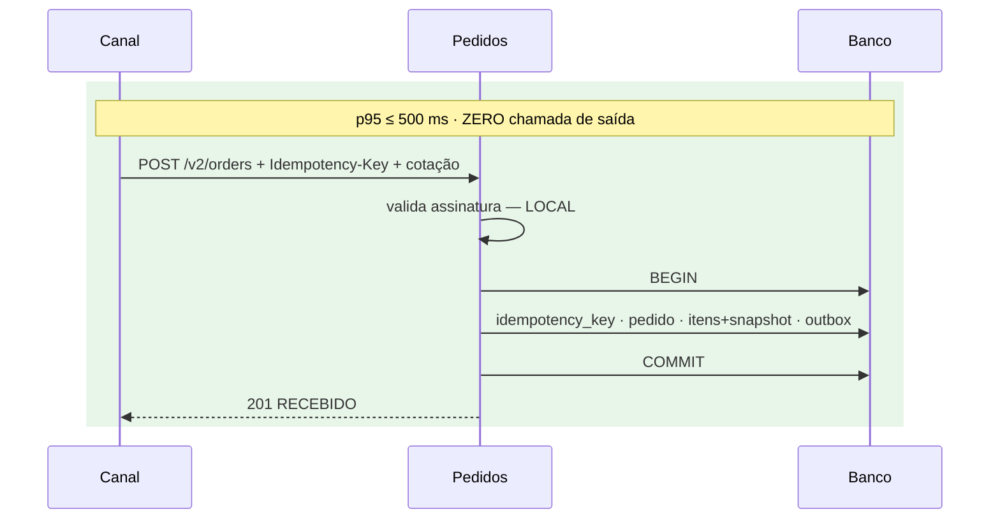

# Apresentação — Evolução da Plataforma de Pedidos e Catálogo

**Slug do PRD:** pedidos-catalogo
**Escopo deste documento:** 10 slides cobrindo arquitetura atual, alvo, estratégia de migração, demonstração da prova e trade-offs. Formato de apoio a fala de 8 minutos — a profundidade está nos documentos indexados no `README.md`.
**Fontes:** todos os artefatos do repositório
**Data:** 2026-09-23

> Separador `---` marca troca de slide. Renderiza como apresentação em qualquer ferramenta que leia Markdown com quebra por `---`, e como documento no GitHub.

---

## 1 · O problema

Plataforma de **Pedidos e Catálogo**, hoje um único canal web nacional.

**Quatro débitos estruturais:**

| # | Débito | Escala por |
|---|---|---|
| 1 | Consulta o Catálogo **1× por item** — N+1 | item |
| 2 | **Sem snapshot** de preço — auditoria impossível | mudança de preço |
| 3 | Retry **sem chave**; evento **sem garantia transacional** | retry e volume |
| 4 | **Sem API pública** para parceiros | parceiro na fila |

**Em 90 dias:** app móvel, marketplace, segundo país, **10× o volume** — sem interromper ninguém.

> Toleráveis hoje. Deixam de ser ao 10× **ao mesmo tempo**, porque cada um tem multiplicador próprio.

---

## 2 · A restrição que decidiu tudo

Duas exigências do edital, multiplicadas:

```
Pedidos 99,9%  ×  Catálogo 99,9%  =  99,8%

99,8% de 43.200 min/mês  →  86,4 min indisponível
Error budget exigido      →  43,2 min

Estouro de 2×, com tudo o mais funcionando.
```

**O SLA não fecha na aritmética** — não importa quão bem o código seja escrito.

> Isso transforma *"desacoplar é boa prática"* em **restrição dura**.

---

## 3 · Onde estamos


No alvo, o Catálogo receberia **~338 req/s** contra 37,5 de Pedidos. **Satura primeiro e derruba a criação junto.**

---

## 4 · Para onde vamos


Tudo que exige resposta externa foi para **antes** ou para **depois**.

---

## 5 · O aceite é local



**Uma transação, quatro garantias.** Idempotência pela `PRIMARY KEY`, snapshot imutável, outbox no mesmo commit, nenhuma dependência externa.

> **De seis componentes, apenas um derruba a criação de pedido.**

---

## 6 · Migração em três ondas

| Onda | Ataca | Gate |
|---|---|---|
| **30** | idempotência · outbox · snapshot | 0 duplicatas · 0 eventos perdidos · **0 downtime** |
| **60** | API de parceiros · fim do N+1 | 1 parceiro integrado · **0 consumidor quebrado** |
| **90** | app · segundo país · 10× | 99,9% · legado descomissionado |

**A ordem segue natureza do dano, não visibilidade:**

> Duplicidade, evento perdido e ausência de snapshot **corrompem dado** — irreversível.
> N+1, canal bloqueado e evolução travada **degradam experiência** — reversível.

Por isso a onda 30 **não** ataca o N+1, que é a dor mais visível.

---

## 7 · A prova — 111 testes em PostgreSQL real

```
$ cd slice && python prova.py
111 passed
```

| ⭐ | Teste | Prova |
|---|---|---|
| ⭐ | 20 requisições concorrentes, mesma chave | **1 pedido** · 1× `201` + 19× `200` |
| ⭐ | consumidor v1 com a v2 no ar | **não quebra** |
| | relay derrubado entre publicar e marcar | evento duplica, **nunca se perde** |
| | consulta com o Catálogo fora do ar | pedido é **autocontido** |

⭐ = critérios críticos do edital

> As 19 respostas de replay só existem por **violação da `PRIMARY KEY`**. As threads competiram de verdade — foi a constraint que segurou, não o código.

---

## 8 · O trade-off que mais custa

**`201 Created` mudou de significado** — de *"venda confirmada"* para *"pedido recebido"*.

| | v1 | v2 |
|---|---|---|
| JSON | idêntico | idêntico |
| Status code | `201` | `201` |
| **Significado** | venda feita | pedido recebido |

**Um diff de schema passa.** E todo consumidor que emite nota fiscal no `201` quebra em produção.

**Solução:** fachada síncrona na v1 durante os 6 meses de compatibilidade. Débito **com data de vencimento**.

> Compatibilidade é **estrutural e semântica**. Validar só schema entrega falsa segurança — pior que nenhuma, porque o pipeline verde autoriza o merge.

---

## 9 · Investimento — fase 1

| | |
|---|---|
| **Esforço** | **79 dias-pessoa** · 47 tarefas decompostas |
| **Time** | 5,5 pessoas — 1 arquiteto (30%), 2 sênior, 1 pleno, 1,5 SRE |
| **Prazo** | 20 dias úteis · cabe nos 30 |
| **Infraestrutura** | US$ 1.700–3.700/mês |

**O time saiu do esforço, não o contrário.** E revelou: **SRE consome 26%** — mais que o dobro do arquiteto.

A causa é *zero janela de indisponibilidade*: rollout progressivo, alertas de falha silenciosa e reversibilidade sem deploy são trabalho de **operação**.

> Essa restrição custa **+15% do esforço**. Um concorrente que não a respeitar parecerá mais barato **entregando outra coisa**.

---

## 10 · O que precisa de decisão

| # | Decisão | Bloqueia |
|---|---|---|
| **V1** | Há integrações no caminho de criação além do Catálogo? | **prazo da onda 30** |
| **V3** | Baseline atual — duplicatas, eventos perdidos, p95 | **gate G30** |
| **V7** | Teto de custo de infraestrutura | verificação da dimensão custo |

**47 lacunas permanecem marcadas `???`** — todas de baseline de produção. Números que só existem **medindo**. Inventá-los contaminaria métricas e estimativa.

> Marcar a lacuna é decisão, não omissão.

---

### Em uma frase

**A conta de disponibilidade não fecha com dependência síncrona no caminho crítico; a onda 30 corrige o que corrompe dado antes do que incomoda o usuário; e os 15% que a continuidade custa são o que separa esta proposta de uma que parece mais barata entregando outra coisa.**
