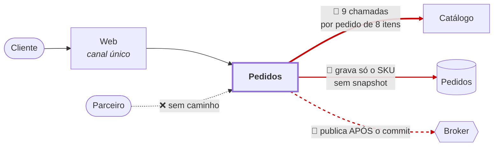
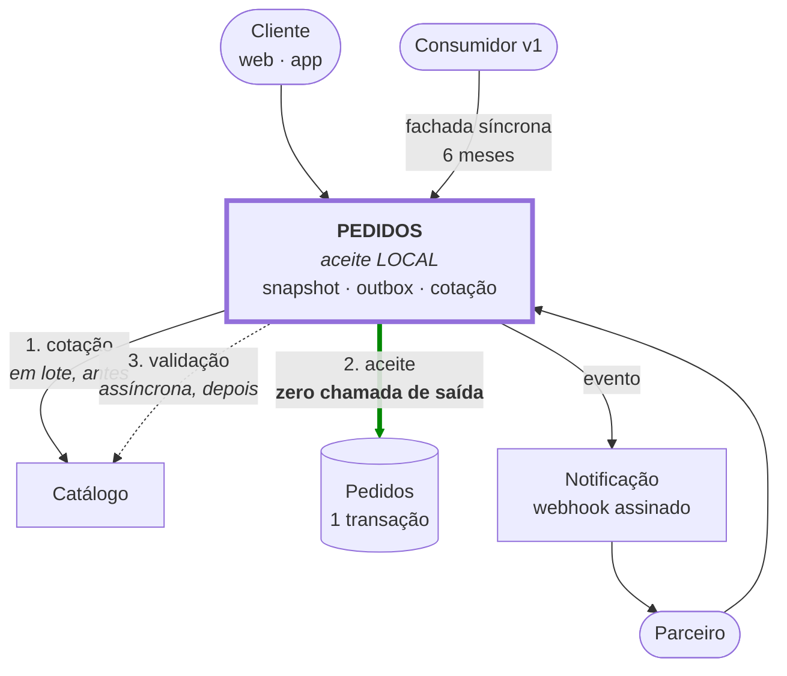
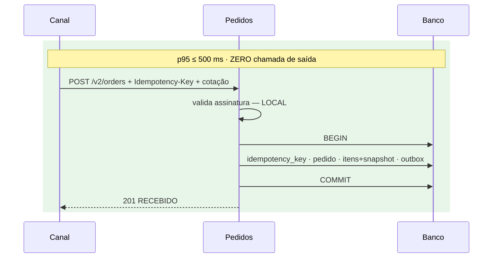
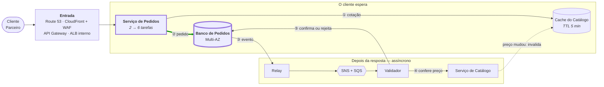

# Apresentação — Evolução da Plataforma de Pedidos e Catálogo

**Slug do PRD:** pedidos-catalogo
**Escopo deste documento:** 12 slides cobrindo arquitetura atual, alvo, implantação na AWS, estratégia de migração, demonstração da prova, trade-offs e o uso de IA na elaboração. Feitos para leitura autônoma, sem narração: cada slide traz no rodapé o documento com o detalhe, e a profundidade está nos documentos indexados no `README.md`.
**Fontes:** todos os artefatos do repositório
**Data:** 2026-09-23

> Separador `---` marca troca de slide. Para apresentar, `python tools/gerar-slides.py` gera a versão em HTML, com os diagramas desenhados.

---

## 1 · O problema

Plataforma de **Pedidos e Catálogo**, hoje um único canal web nacional.

**Quatro débitos estruturais:**

| # | Débito | Escala por |
|---|---|---|
| 1 | Consulta o Catálogo **1× por item** — N+1 | item |
| 2 | **Sem snapshot** de preço — auditoria impossível | mudança de preço |
| 3 | Retry **sem chave**; evento **sem garantia transacional** | retry e volume |
| 4 | **Sem API pública** para parceiros | parceiro na fila |

**Em 90 dias:** app móvel, marketplace, segundo país, **10× o volume** — sem interromper ninguém.

> Toleráveis hoje. Deixam de ser ao 10× **ao mesmo tempo**, porque cada um tem multiplicador próprio.

Detalhe: `README.md` · `docs/prd/pedidos-catalogo.md`

---

## 2 · A restrição que decidiu tudo

Duas exigências do enunciado, multiplicadas:

```
Pedidos 99,9%  ×  Catálogo 99,9%  =  99,8%

99,8% de 43.200 min/mês  →  86,4 min indisponível
Error budget exigido      →  43,2 min

Estouro de 2×, com tudo o mais funcionando.
```

**O SLA não fecha na aritmética** — não importa quão bem o código seja escrito.

> Isso transforma *"desacoplar é boa prática"* em **restrição dura**.

Detalhe: `docs/technical-context/constraints.md` §8

---

## 3 · Onde estamos



No alvo, o Catálogo receberia **~338 req/s** contra 37,5 de Pedidos. **Satura primeiro e derruba a criação junto.**

Detalhe: `docs/technical-context/c4/containers-as-is.md`

---

## 4 · Para onde vamos



Tudo que exige resposta externa foi para **antes** ou para **depois**.

Detalhe: `docs/technical-context/c4/containers-to-be.md` · `architecture.md`

---

## 5 · O aceite é local



**Uma transação, quatro garantias.** Idempotência pela `PRIMARY KEY`, snapshot imutável, outbox no mesmo commit, nenhuma dependência externa.

> **De seis componentes, apenas um derruba a criação de pedido** — o próprio banco, Multi-AZ.

Detalhe: `docs/technical-context/c4/seq-criacao-pedido.md` · ADRs 0001, 0002, 0003 e 0007

---

## 6 · Como roda na AWS



**① e ② são o que o cliente espera** — a cotação lê o cache; o pedido só confere a assinatura e grava. **③ a ⑤ acontecem depois.** Só o banco de Pedidos derruba a criação. **US$ 1,8–3,0 mil/mês.**

Detalhe: `docs/technical-context/servicos-aws.md` — rede, escala, invalidação do cache, custos e alternativas

---

## 7 · Migração em três ondas

| Onda | Ataca | Critério para avançar |
|---|---|---|
| **30** | idempotência · outbox · snapshot | 0 duplicatas · 0 eventos perdidos · **0 downtime** |
| **60** | API de parceiros · fim do N+1 | 1 parceiro integrado · **0 consumidor quebrado** |
| **90** | app · segundo país · 10× | 99,9% · legado descomissionado |

**A ordem segue natureza do dano, não visibilidade:**

> Duplicidade, evento perdido e ausência de snapshot **corrompem dado** — irreversível.
> N+1, canal bloqueado e evolução travada **degradam experiência** — reversível.

Por isso a onda 30 **não** ataca o N+1, que é a dor mais visível.

Detalhe: `docs/delivery/plano-30-60-90.md`

---

## 8 · A prova — 132 testes em PostgreSQL real

```
$ cd slice && python prova.py
131 passed, 1 skipped
```

| ⭐ | Teste | Prova |
|---|---|---|
| ⭐ | 20 requisições concorrentes, mesma chave | **1 pedido** · 1× `201` + 19× `200` |
| ⭐ | consumidor v1 com a v2 no ar | **não quebra** |
| | relay derrubado entre publicar e marcar | evento duplica, **nunca se perde** |
| | consulta com o Catálogo fora do ar | pedido é **autocontido** |

⭐ = critérios críticos do enunciado · o teste pulado verifica exceção técnica vencida, e nenhuma está registrada

> As 19 respostas de replay só existem por **violação da `PRIMARY KEY`**. As threads competiram de verdade — foi a constraint que segurou, não o código.

Detalhe: `slice/README.md` — cada módulo, a decisão que implementa e o teste que a prova

---

## 9 · O trade-off que mais custa

**`201 Created` mudou de significado** — de *"venda confirmada"* para *"pedido recebido"*.

| | v1 | v2 |
|---|---|---|
| JSON | idêntico | idêntico |
| Status code | `201` | `201` |
| **Significado** | venda feita | pedido recebido |

**Um diff de schema passa.** E todo consumidor que emite nota fiscal no `201` quebra em produção.

**Solução:** fachada síncrona na v1 durante os 6 meses de compatibilidade. Débito **com data de vencimento**.

> Compatibilidade é **estrutural e semântica**. Validar só schema entrega falsa segurança — pior que nenhuma, porque o pipeline verde autoriza o merge.

Detalhe: `docs/decisions/ADR-0004-versionamento-e-compatibilidade-semantica.md`

---

## 10 · Como o projeto foi feito — especificação antes do código

**Desenvolvimento guiado por especificação (SDD), com o Claude conduzindo entrevistas.** Cada artefato nasce de um comando versionado no repositório, que faz uma pergunta por vez até a especificação fechar:

| Etapa | Comando | O que define |
|---|---|---|
| Negócio | `/prd` | tese, hipótese, escopo dentro e fora, critério de pronto |
| Pessoas | `/persona` · `/jornada` | para quem é, e onde dói hoje |
| Restrições | `/constraints` | cada exigência do enunciado vira número verificável |
| Decisões | `/adr` · `/arquitetura` · `/c4` | alternativas confrontadas e o porquê de cada escolha |
| Entrega | `/contratos` · `/estimativa` | contratos, tarefas, time e custo |

Só depois vem o código — e ele é verificado pelos testes e pela conferência automática da entrega.

> **A IA propõe, calcula e verifica. A decisão é humana** — 10 sugestões da IA foram rejeitadas, cada uma com o motivo registrado.

Detalhe: `docs/ai-context/uso-de-ia.md` · comandos em `.claude/commands/`

---

## 11 · Investimento — fase 1

| | |
|---|---|
| **R$ 155–162 mil** | total da fase 1 — pessoas, licenças e infraestrutura |
| **5 pessoas · 20 dias úteis** | arquiteto em meio período, 2 sênior, 1 pleno, 1 SRE |
| **63 dias-pessoa** | 47 tarefas decompostas, com desenvolvimento assistido por IA |

**Quem define o prazo é o SRE, não o dev.** Zero janela de indisponibilidade é trabalho de operação — rollout em degraus, alerta de falha silenciosa, reversão sem deploy — e a IA quase não o acelera.

> A IA vira **uma pessoa a menos**, não uma data mais cedo.

Detalhe: `docs/delivery/estimativa-fase1.md` · `taxas-de-mercado.md` · `resumo-executivo.md`

---

## 12 · O que o cliente precisa decidir

| Pergunta | Por que importa |
|---|---|
| **Existem outros sistemas chamados na criação do pedido**, além do Catálogo? | cada um traz de volta a dependência do slide 2 — e muda o prazo da primeira onda |
| **Quantos pedidos duplicam e quantos eventos se perdem hoje?** | sem o número de hoje, não há como provar que a primeira onda resolveu |
| **Qual o teto de custo de infraestrutura?** | sem teto, não dá para dizer se US$ 1,8–3,0 mil/mês cabe no orçamento |

O que não tem dado **ficou marcado como desconhecido, não inventado**: são números que só existem medindo o sistema atual.

> Marcar a lacuna é decisão, não omissão.

Detalhe: `docs/delivery/riscos-premissas.md` §5

---

## Para levar

1. **A disponibilidade exigida não fecha com o Catálogo no caminho do pedido.** Por isso criar o pedido virou uma operação local — e só o banco de Pedidos pode derrubá-la.
2. **A primeira onda corrige o que corrompe dado**, não o que é mais visível.
3. **Está provado:** 132 testes em PostgreSQL real, rodando a cada push.

**Para aprofundar, o `README.md` organiza a leitura em três níveis:**

| Tempo | O que ler |
|---|---|
| **10 minutos** | resumo executivo → ADR-0007 → rodar a prova |
| **30 minutos** | + C4 do estado-alvo → sequência de criação → ADRs 0001, 0002 e 0003 |
| **2 horas** | + threat model → plano 30/60/90 → decomposição → estimativa |

Detalhe: `README.md` — roteiro de leitura e índice de todos os artefatos
