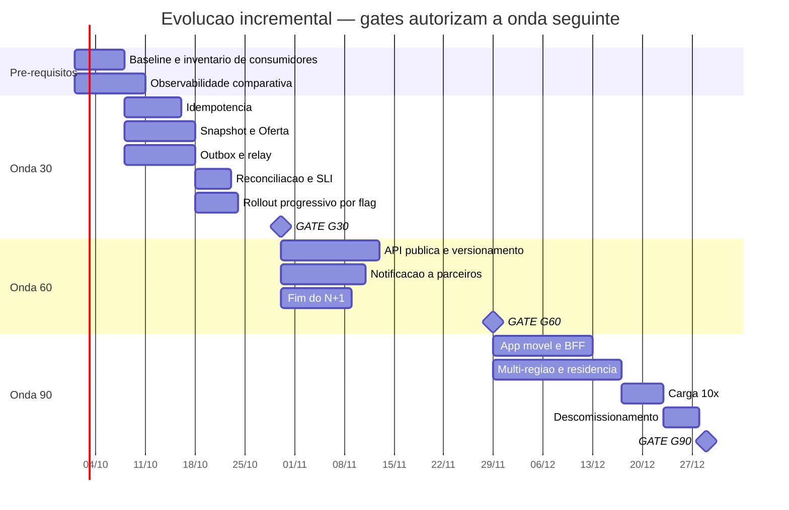

# Plano incremental 30/60/90

**Slug do PRD:** pedidos-catalogo
**Escopo deste documento:** as três ondas de evolução, decompostas em tarefas estimáveis. A fase 1 é detalhada a ponto de gerar esforço; as fases 2 e 3 ficam em granularidade de entrega, porque §2.5.3 limita o compromisso orçado à primeira.
**Requisitos cobertos:** `P2-01`, `CTX-11`, `CTX-12`
**Fontes:** `docs/prd/pedidos-catalogo.md` (§5, critério de pronto), `docs/technical-context/architecture.md`, ADRs 0001 a 0007
**Data:** 2026-09-23

---

## Princípio: cada onda entrega valor sozinha

Parar em G30 ou G60 **não é fracasso**. Cada gate tem critério observável e autoriza o seguinte — a decisão de continuar é do negócio. É isso que distingue proposta incremental de *big bang* fatiado.

A ordem das ondas não segue visibilidade, segue **natureza do dano**:

> Duplicidade, perda de evento e ausência de snapshot **corrompem dado** — cada dia de operação produz estrago que nenhuma correção futura desfaz. N+1, canal bloqueado e evolução travada **degradam experiência**: doem continuamente, mas não deixam cicatriz.

Por isso a onda 30 ataca idempotência, outbox e snapshot, e **não** o N+1 — que é a dor mais visível e a mais fácil de demonstrar. Um pedido duplicado hoje não pode ser desduplicado depois.

---

## Onda 30 — parar o sangramento

**Objetivo:** eliminar as três dores irreversíveis, em produção, **sem janela de indisponibilidade** (`CTX-11`).

### Pré-requisitos — não são entrega da onda, são condição dela

| # | Tarefa | Por quê |
|---|---|---|
| P1 | Levantar baseline: duplicatas/mês, eventos perdidos, p95 atual, nº de consumidores | Sem régua, o gate G30 é indecidível. Hoje todos são `???` |
| P2 | Instrumentar observabilidade comparativa (caminho novo × antigo) | Convivência exige comparar resultado, não só latência |
| P3 | Inventariar consumidores atuais e suas versões | `CTX-10` não tem como ser verificado sem isso |

Tratar P1–P3 como tarefa paralela é o erro mais comum. Eles **bloqueiam** o gate.

### Entregas

| # | Tarefa | ADR | Risco |
|---|---|---|---|
| A1 | Schema: `idempotency_key` com PK `(chamador, chave)` | 0001 | baixo |
| A2 | `Idempotency-Key` no POST; replay com estado corrente; 409 em conflito | 0001 | médio |
| A3 | Normalização canônica do payload para o hash | 0001 | **alto** — fonte clássica de 409 falso |
| A4 | Schema: colunas de snapshot `NOT NULL` em `pedido_item` | 0003 | baixo |
| A5 | Serviço de Oferta: cotação em lote, assinatura, validade | 0003, 0007 | médio |
| A6 | Gravar snapshot dos termos na criação | 0003 | baixo |
| A7 | Schema e tabela `outbox` | 0002 | baixo |
| A8 | Relay com `FOR UPDATE SKIP LOCKED`, publica antes de marcar | 0002 | médio |
| A9 | Deduplicação por `event_id` nos consumidores | 0002 | **alto** — depende de terceiros |
| A10 | Expurgo de outbox e de chaves expiradas | 0001, 0002 | baixo |
| A11 | SLI: idade do evento mais antigo não publicado, com alerta | 0002 | médio |
| A12 | Feature flag por percentual + rollback sem deploy | `CTX-11` | médio — **mecanismo provado na fatia** |
| A13 | Job de reconciliação: pedidos presos em validação, outbox parado, cotações órfãs | 0007 | médio |
| A14 | Contract test v1 no CI | 0004 | médio |
| A15 | Autorização por dono no `GET`, com `404` indistinguível | threat model F1.4/F2.5 | baixo |

### Convivência e rollback

Strangler Fig com flag: o caminho novo entra por percentual (1% → 10% → 50% → 100%), comparando resultado contra o antigo a cada degrau. **Rollback é desligar a flag** — sem deploy, sem migração reversa.

O schema é aditivo: colunas e tabelas novas, nada removido. Reverter o código não quebra o banco.

### Gate G30 — critério observável

- Chamadas repetidas com a mesma chave não criam pedido duplicado, **verificado em produção**
- Zero evento perdido entre commit e publicação
- Snapshot gravado em 100% dos pedidos novos
- **Zero janela de indisponibilidade** durante todo o rollout
- Rollback exercitado ao menos uma vez em produção, por flag
- → autoriza a onda 60

### O que **não** entra na onda 30

N+1, API pública, app móvel, segundo país, read model. Nenhum deles corrompe dado.

---

## Onda 60 — abrir o canal de parceiros

**Objetivo:** destravar a receita bloqueada e eliminar o N+1.

| Entrega | ADR / CTX |
|---|---|
| API pública v1 para parceiros: OAuth2, escopos, quotas | `CTX-08`, `P1-16` |
| Versionamento com `Deprecation`/`Sunset`; fachada síncrona v1 | 0004 |
| Gateway de notificação: webhook assinado, retry, backoff, DLQ | `CTX-08` |
| Resolução em lote: 9 chamadas → 2 | `CTX-05` |
| Aceitação assíncrona exposta em `/v2` | 0007 |
| Observabilidade segmentada **por versão de contrato** | 0004 |
| Onboarding self-service de parceiro | `CTX-08` |

### Gate G60

- API pública v1 em produção, com ao menos um parceiro real integrado
- Notificação assíncrona entregue e confirmada por esse parceiro
- N+1 eliminado; p95 ≤ 500 ms sustentado na carga corrente
- **Zero consumidor atual quebrado** (`CTX-10`, `CTX-12`)
- Taxa de rejeição pós-aceite dentro do limite acordado com o negócio
- → autoriza a onda 90

---

## Onda 90 — escala, app e segundo país

**Objetivo:** sustentar 10× e operar em duas regiões.

| Entrega | ADR / CTX |
|---|---|
| BFF multi-canal atendendo app móvel | `CTX-01` |
| Multi-região com segregação de PII por domicílio | `CTX-09b`, `ADR-0006` |
| **Serviço de preferências de privacidade** — opt-out de venda/compartilhamento, sinal GPC | `CTX-09d` — **escopo novo**, surgido com `PR-03` = EUA |
| Instrumento de transferência internacional BR → EUA | `CTX-09c`, decisão `V9` |
| Multi-moeda | `CTX-01` |
| Teste de carga a 10×; autoscaling calibrado | `CTX-02` |
| Read model do Catálogo, **se** o cache não sustentar o p95 | 0003 |
| Descomissionamento do caminho legado | `CTX-11` |

### Gate G90

- App móvel e segundo país em produção
- 10× suportado com p95 ≤ 500 ms e 99,9% mensal
- PII segregada por domicílio do titular; instrumento de transferência BR → EUA em vigor
- Caminho legado descomissionado **ou** com data acordada

---

## Descomissionamento

Nada é removido antes de evidência de que ninguém usa. Sequência:

1. **Marcar** — `Deprecation` e `Sunset` nas respostas da v1
2. **Medir** — tráfego por versão, por consumidor, no painel
3. **Avisar** — comunicação ativa aos consumidores com tráfego residual
4. **Esperar** — a janela de `CTX-10` é mínimo, não teto
5. **Desligar** — primeiro com kill switch reversível, só depois remover código

A fachada síncrona v1 morre junto com a v1. **Fachada sem consumidor é complexidade órfã que sobrevive por inércia** — por isso "último consumidor migrou" é gatilho de revisão na `ADR-0004`.

---

## Linha do tempo

---

## Riscos do plano

1. **Os pré-requisitos P1–P3 escorregarem.** Sem baseline, o G30 vira decisão por fé; sem inventário de consumidores, `CTX-10` não é verificável. São o caminho crítico real da onda 30.
2. **A tarefa A9 depende de terceiros.** Deduplicação nos consumidores exige que eles mudem. Se forem externos, vira negociação contratual — e a `ADR-0004` registra que não sabemos se são internos ou externos.
3. **"Sem janela de indisponibilidade" encarece a fase 1.** Flag, convivência e rollout progressivo custam mais que uma migração com janela de manutenção. É consequência de `CTX-11`, e precisa estar visível na proposta, não absorvida em silêncio.
4. **A fricção piora antes de melhorar.** Durante a convivência, reconciliar entre dois caminhos é trabalho **novo**, que não existia antes. Custo legítimo da estratégia incremental, e precisa entrar na estimativa.
5. **O escopo foi recortado a Pedidos e Catálogo.** Contextos não nomeados pelo enunciado foram removidos do desenho. Se a plataforma real tiver integrações adicionais no caminho de criação, o dimensionamento da onda 30 muda.

## Pendências registradas

- As datas do Gantt são ilustrativas, ancoradas em um início hipotético em 2026-10-01.
- `V9` (instrumento jurídico de transferência BR → EUA) é pré-requisito da onda 90.
