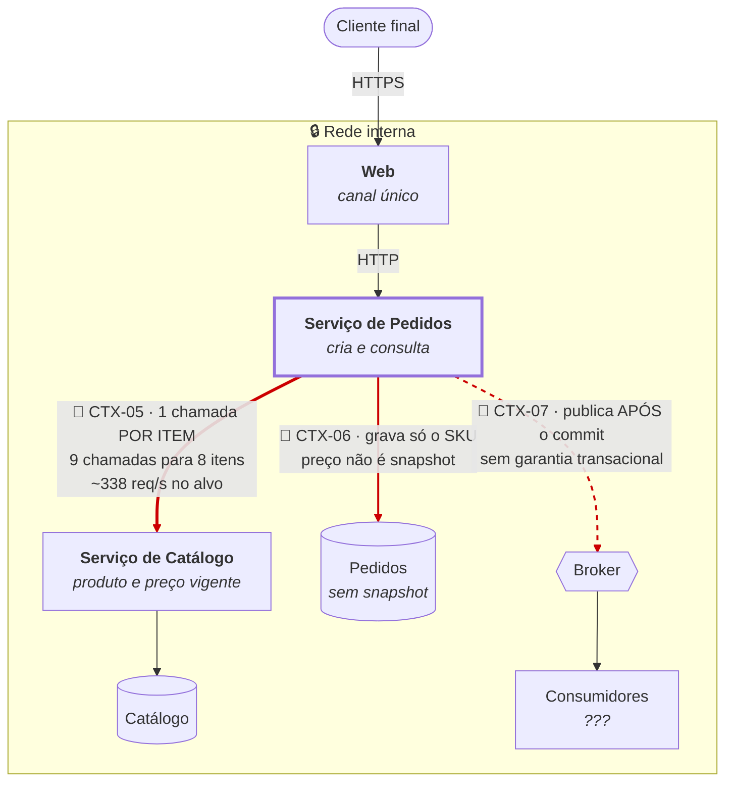

# C4 Nível 2 — Contêineres · Estado atual

**Slug do PRD:** pedidos-catalogo
**Escopo deste documento:** contêineres, protocolos e datastores de hoje, com os quatro débitos de `CTX-05` a `CTX-08` localizados no desenho.
**Requisitos cobertos:** `P1-02`, `P1-07`
**Fontes:** `contexto/...pdf` (§2.2.1), `docs/business-context/jornada.md`
**Data:** 2026-09-22

---

---

## Leitura do diagrama

**A seta grossa vermelha é o N+1.** Pedidos consulta o Catálogo uma vez por item. Um pedido de 8 itens gera 9 chamadas; no p95 de 15 itens, 16. Ela multiplica **duas vezes** — por item e por pedido concorrente —, então no alvo o Catálogo recebe ~338 req/s contra 37,5 de Pedidos. Ele satura primeiro.

**A seta tracejada é a escrita dupla.** Publicar depois do commit significa que uma falha na publicação deixa pedido sem evento. Não há ordem segura entre gravar no banco e publicar no broker — é o problema que a `ADR-0002` resolve.

**O banco de Pedidos guarda referência, não termo acordado.** Por isso a auditoria de preço é impossível: o dado do preço praticado **nunca existiu**. Não está perdido.

## Os quatro débitos, localizados

| Débito | Onde está no diagrama | Como escala |
|---|---|---|
| `CTX-05` N+1 | seta Pedidos → Catálogo | por **item** |
| `CTX-06` sem snapshot | datastore de Pedidos | por **mudança de preço** |
| `CTX-07` sem idempotência e sem outbox | entrada de Pedidos e seta para o broker | por **retry** e por **volume** |
| `CTX-08` sem API pública | ausência de contêiner de borda | por **parceiro na fila** |

## Pontos de falha

| Componente | Se falhar | Hoje |
|---|---|---|
| Catálogo | **derruba a criação de pedido** | dependência síncrona no caminho crítico |
| Broker | eventos se perdem | publicação não transacional |
| Banco de Pedidos | tudo para | SPOF |

O primeiro é o mais grave e é aritmético: com dependência síncrona, disponibilidade percebida = 99,9% × 99,9% = **99,8%**, o dobro do error budget de `CTX-03`. Ver `constraints.md` §8.
