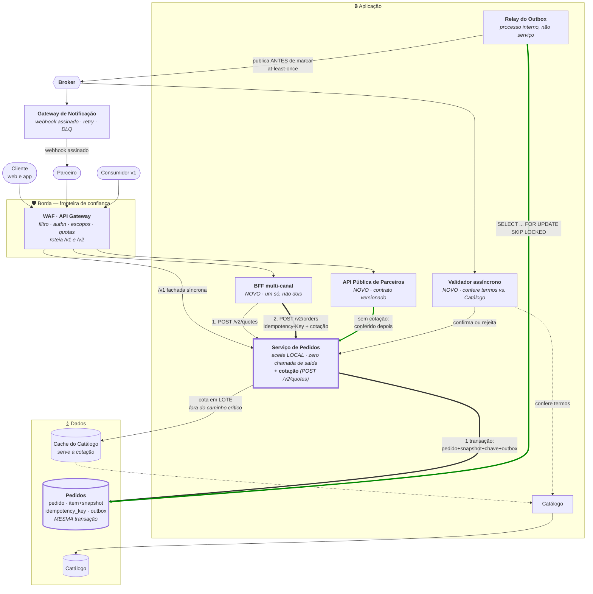

# C4 Nível 2 — Contêineres · Arquitetura-alvo

**Slug do PRD:** pedidos-catalogo
**Escopo deste documento:** contêineres do alvo, com o delta em relação ao as-is marcado. Escopo recortado a Pedidos e Catálogo.
**Requisitos cobertos:** `P1-04`, `P1-07`
**Fontes:** `docs/technical-context/architecture.md`, ADRs 0001 a 0007
**Data:** 2026-09-23

---

---

## Leitura do diagrama

**A seta verde grossa para o banco é a decisão inteira.** Pedido, itens com snapshot, chave de idempotência e registro no outbox entram em **uma transação**. É daí que saem as garantias de `ADR-0001`, `ADR-0002` e `ADR-0003` — e é por isso que o store é relacional: não é preferência, é requisito.

**Não há seta de Pedidos para fora no caminho de aceite.** A leitura do Catálogo acontece no passo 1 (cotação) e na validação assíncrona. O passo 2 — o que `CTX-04` cronometra — é puramente local.

**A cotação é do próprio Pedidos, não de um serviço à parte.** Ela existe para tirar a leitura do Catálogo do caminho crítico, e quem a emite é quem precisa do resultado. Criar um contêiner separado para isso seria complexidade sem `CTX` que a justifique.

**A API Pública entra direto no aceite, sem cotar.** Parceiro submete os termos do sistema dele, conferidos depois pelo validador — e por isso sua taxa de rejeição pós-aceite é estruturalmente maior. Assimetria deliberada, não lacuna.

**O relay é um processo dentro de Pedidos, não um serviço.** Ele lê a tabela `outbox`, que pertence a Pedidos; um serviço separado lendo esse banco quebraria o ownership do mapa de domínios.

**O cache serve a cotação, não a leitura de pedido.** Depois da criação, o pedido é autocontido: nenhuma leitura de pedido toca o Catálogo — garantido pelo teste que executa a consulta com o Catálogo fora do ar.

## Pontos de falha e degradação

| Componente | Se falhar | Aceite continua? |
|---|---|---|
| **Banco de Pedidos** | aceite para | ❌ **único SPOF** — multi-AZ obrigatório |
| Broker | eventos não saem, outbox acumula | ✅ |
| Relay | publicação atrasa | ✅ falha **silenciosa** — depende do SLI |
| Catálogo / Cache | não dá para cotar nem validar | ✅ novos pedidos ficam em `RECEBIDO`; reconciliação assume |
| Validador | desfecho não chega | ✅ pedidos permanecem em `RECEBIDO` |
| Gateway de Notificação | webhook falha | ✅ retry, backoff, DLQ — bulkhead |

**Dos seis componentes, apenas um derruba a criação.** Essa é a propriedade que o desenho compra em troca da complexidade assíncrona.

## O que **não** está aqui

Service mesh, CQRS, event sourcing, sharding e BFF por canal foram deliberadamente omitidos — cada um com o gatilho numérico que o traria de volta em `architecture.md`.

Estoque, Pagamento e Carrinho também não estão, e por outro motivo: **o enunciado não os nomeia.** Ausência por escopo, não por dimensionamento (`AV-08`).
