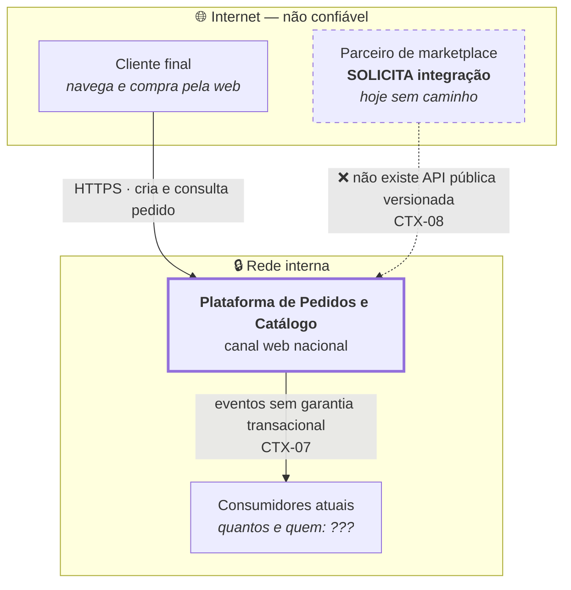

# C4 Nível 1 — Contexto · Estado atual

**Slug do PRD:** pedidos-catalogo
**Escopo deste documento:** o sistema como está hoje: canal web nacional único.
**Requisitos cobertos:** `P1-01`
**Fontes:** `contexto/...pdf` (§2.2, §2.2.1), `docs/technical-context/constraints.md`
**Data:** 2026-09-22

---

---

## Leitura do diagrama

**A linha tracejada é o ponto.** O parceiro de marketplace é o único ator que o enunciado mostra **pedindo** algo (`CTX-08`), e não existe caminho para ele. Não é integração ruim — é integração ausente. Canal de receita bloqueado.

**Um canal só.** Toda a operação passa pela web nacional. As três expansões de `CTX-01` — app móvel, marketplace e segundo país — não têm por onde entrar.

**A seta para os consumidores é frágil.** Os eventos são publicados após o commit, sem garantia transacional: se a publicação falhar, o pedido existe e o evento nunca saiu.

## Fronteiras de confiança

| # | Fronteira | Estado atual |
|---|---|---|
| 1 | Internet → plataforma | autenticação de cliente final |
| 2 | Plataforma → consumidores | interna, sem contrato versionado |

Não existe fronteira para parceiro externo, porque não existe parceiro integrado.

## O que este diagrama não mostra

Quem são os consumidores atuais e se são internos ou externos permanece `???`. É a pendência mais consequente em aberto: muda `CTX-10` de negociável para contratual (ver `ADR-0004`).
