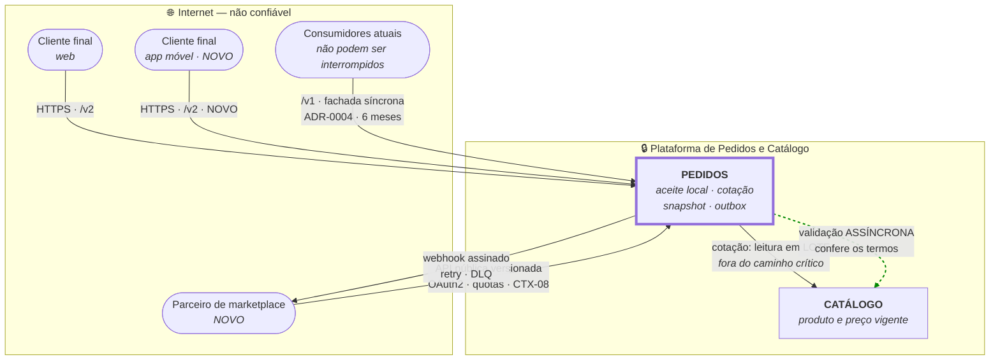

# C4 Nível 1 — Contexto · Arquitetura-alvo

**Slug do PRD:** pedidos-catalogo
**Escopo deste documento:** o sistema em 90 dias: três canais, duas regiões. Escopo recortado ao que o enunciado nomeia — Pedidos e Catálogo, mais as capacidades que §2.2.1 exige.
**Requisitos cobertos:** `P1-03`
**Fontes:** `docs/technical-context/architecture.md`, `docs/business-context/mapa-dominios.md`, `ADR-0004`, `ADR-0007`
**Data:** 2026-09-23

---

---

## Leitura do diagrama

**Só dois sistemas dentro da plataforma.** Uma versão anterior deste diagrama incluía Estoque e Pagamento. Eles foram removidos porque o enunciado não os nomeia — incluí-los era inventar escopo, e estavam registrados como a premissa mais perigosa da proposta (`PR-07`).

**As duas setas para o Catálogo são de naturezas diferentes.** A sólida é a **cotação**: leitura em lote, fora do caminho crítico. A tracejada é a **validação**: assíncrona, depois do aceite. Nenhuma das duas bloqueia a criação de pedido — é isso que torna `CTX-03` alcançável.

**Duas setas para o parceiro, não uma.** Entrada pela API pública versionada e saída por webhook assinado. `CTX-08` pede as duas, e a de saída é a que muda a natureza da plataforma: a notificação de status deixa de ser cortesia e vira o **canal primário de resultado** (`ADR-0007`).

**Os consumidores atuais entram por `/v1`, e isso é deliberado.** Eles não sabem que o núcleo virou assíncrono. A fachada síncrona os protege durante os 6 meses de `CTX-10`. É débito com data de vencimento.

## O delta em relação ao as-is

| Novo | Por quê |
|---|---|
| App móvel e parceiro como atores | `CTX-01` |
| API pública versionada + webhook | `CTX-08` |
| `/v1` como fachada síncrona | `CTX-10`, `CTX-12`, `ADR-0004` |
| Cotação como capacidade de Pedidos | `ADR-0007` — tira a leitura do caminho crítico |
| Validação assíncrona contra o Catálogo | `CTX-17`, `ADR-0007` |
| Segregação de PII por domicílio | `CTX-09b`, `ADR-0006` |

## Fronteiras de confiança

| # | Fronteira | Controle |
|---|---|---|
| 1 | Internet → cliente final | autenticação de cliente, rate limit |
| 2 | Internet → **parceiro** | OAuth2, escopos, quotas — **conteúdo dele é não confiável** |
| 3 | Plataforma → Catálogo | rede interna |
| 4 | Região Brasil ↔ Região EUA | segregação por domicílio do titular · `ADR-0006` |

A fronteira 2 é a mais sensível e recebe tratamento próprio no threat model.
