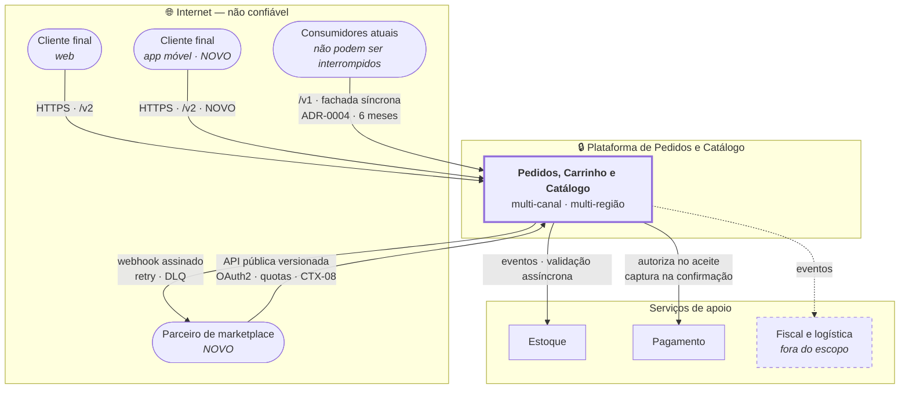

# C4 Nível 1 — Contexto · Arquitetura-alvo

**Slug do PRD:** pedidos-catalogo
**Escopo deste documento:** o sistema em 90 dias: três canais, duas regiões.
**Requisitos cobertos:** `P1-03`
**Fontes:** `docs/technical-context/architecture.md`, `ADR-0004`, `ADR-0007`
**Data:** 2026-09-22

---

---

## Leitura do diagrama

**Duas setas para os parceiros, não uma.** Entrada pela API pública versionada e saída por webhook assinado. `CTX-08` pede as duas coisas, e a de saída é a que muda a natureza da plataforma: a notificação de status deixa de ser cortesia e vira o **canal primário de resultado** (`ADR-0007`).

**Os consumidores atuais entram por `/v1`, e isso é deliberado.** Eles não sabem que o núcleo virou assíncrono. A fachada síncrona os protege durante os 6 meses de `CTX-10`. É débito com data de vencimento.

**Estoque e Pagamento saíram do caminho crítico.** As setas para eles são de validação **posterior**. Nenhuma delas bloqueia o aceite — é o que torna `CTX-03` alcançável.

**Fiscal aparece tracejado de propósito.** Está fora do escopo (PRD, OUT nº 3) e é desenhado apenas para que a fronteira seja explícita, não esquecida.

## O delta em relação ao as-is

| Novo | Por quê |
|---|---|
| App móvel e parceiro como atores | `CTX-01` |
| API pública versionada + webhook | `CTX-08` |
| `/v1` como fachada | `CTX-10`, `CTX-12`, `ADR-0004` |
| Validação assíncrona | `CTX-17`, `ADR-0007` |
| Multi-região | `CTX-09`, residência de dados |

## Fronteiras de confiança

| # | Fronteira | Controle |
|---|---|---|
| 1 | Internet → cliente final | autenticação de cliente, rate limit |
| 2 | Internet → **parceiro** | OAuth2, escopos, quotas — **conteúdo dele é não confiável** |
| 3 | Plataforma → serviços de apoio | rede interna |
| 4 | Região A ↔ Região B | residência de dados · `ADR-0006` **em aberto** |

A fronteira 2 é a mais sensível e recebe tratamento próprio no threat model.
