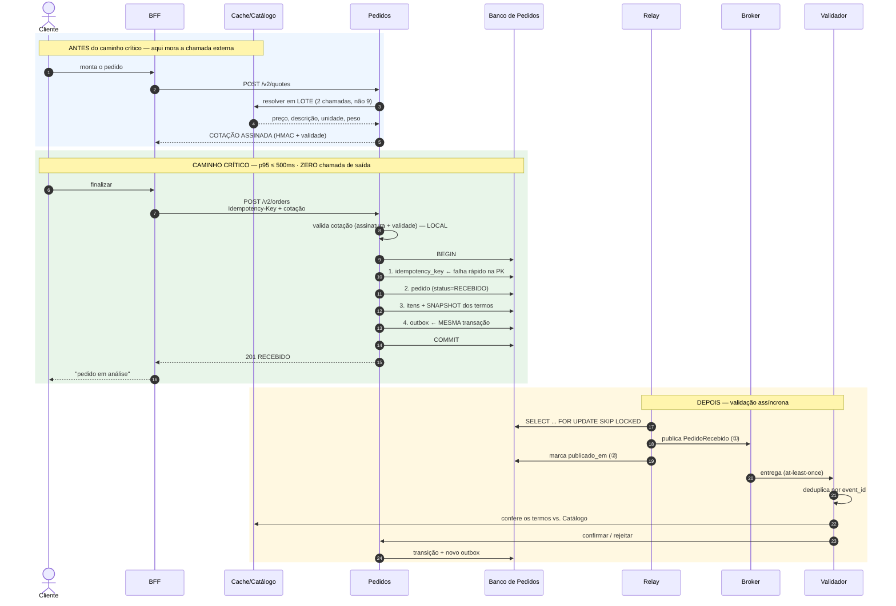
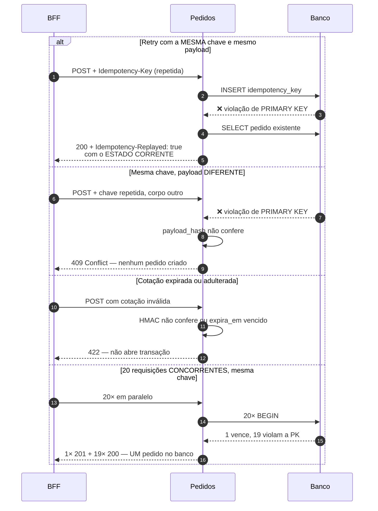

# Sequência — Criação de pedido

**Slug do PRD:** pedidos-catalogo
**Escopo deste documento:** o caminho crítico, com os desvios de erro. Cada passo tem correspondência em teste automatizado.
**Requisitos cobertos:** `P1-05`, `P1-12`, `P1-13`
**Fontes:** `ADR-0001`, `ADR-0002`, `ADR-0003`, `ADR-0007`, `slice/app/pedidos.py`
**Data:** 2026-09-22

---

## Caminho principal — canal próprio

---

## Leitura do diagrama

**As três faixas são a decisão arquitetural.** Tudo que exige resposta externa está na faixa azul (a cotação) ou amarela (a validação). A faixa verde — o caminho crítico que `CTX-04` cronometra — não tem **nenhuma** chamada de saída.

**A ordem dentro da transação não é arbitrária.** A chave de idempotência entra **primeiro** para falhar rápido na `PRIMARY KEY`; se falhar, a transação inteira é revertida, inclusive o outbox — nunca sobra evento órfão.

**A ordem ① antes de ② é a garantia do outbox.** Publicar antes de marcar produz at-least-once: se o relay cair no meio, o evento sai de novo. A ordem inversa perderia o evento.

## Desvios de erro

**O replay devolve o estado corrente, não a resposta gravada.** Com aceite assíncrono, a resposta original foi `RECEBIDO` e o pedido pode já estar `CONFIRMADO`; devolver o texto gravado mentiria. Desvio consciente da convenção de mercado, registrado na `ADR-0001`.

## Correspondência com os testes

| Passo | Teste |
|---|---|
| Caminho principal | `test_criacao_simples_responde_201_e_recebido` |
| Retry mesma chave | `test_replay_com_mesma_chave_devolve_o_mesmo_pedido` |
| **20 concorrentes** | `test_vinte_requisicoes_concorrentes_criam_exatamente_um_pedido` ⭐ |
| Payload divergente | `test_mesma_chave_com_payload_diferente_responde_409` |
| Cotação expirada / adulterada | `test_oferta_expirada_e_recusada`, `test_oferta_adulterada_e_recusada` |
| Cotação honrada mesmo com o Catálogo mudando | `test_cotacao_assinada_e_honrada_mesmo_com_o_catalogo_mudando` |
| Parceiro com preço divergente é rejeitado depois | `test_parceiro_com_preco_divergente_e_rejeitado_apos_o_aceite` |
| Transação única | `test_pedido_e_evento_nascem_na_mesma_transacao` |
| Replay com estado corrente | `test_replay_devolve_estado_corrente_e_nao_o_gravado` |

⭐ = critério crítico do §2.4.2.

## Canal de parceiro

Idêntico a partir do `POST`, **sem a faixa azul**: o parceiro não cota. Preço e atributos vêm no payload dele e são conferidos contra o Catálogo na validação assíncrona. Taxa de rejeição estruturalmente maior — esperado, não defeito.
