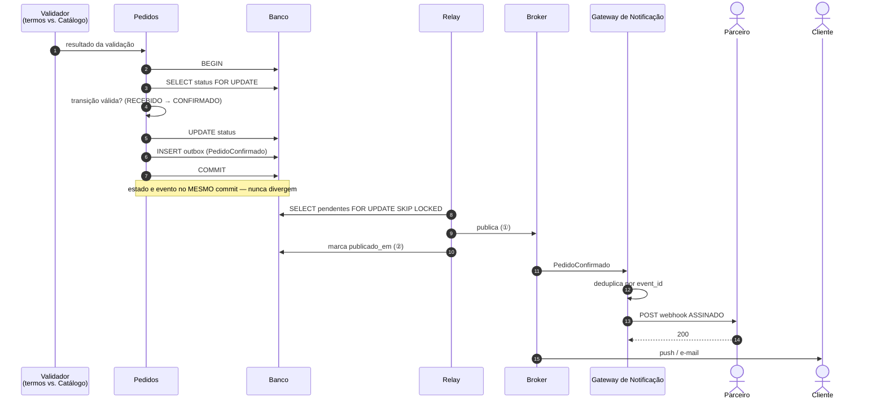
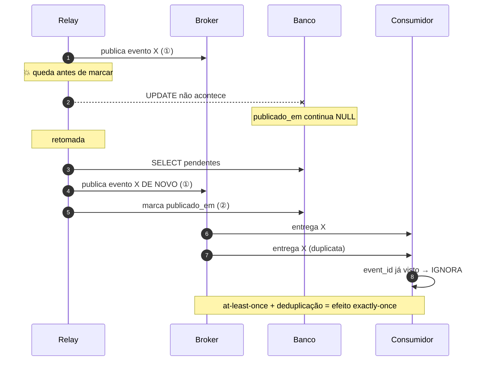
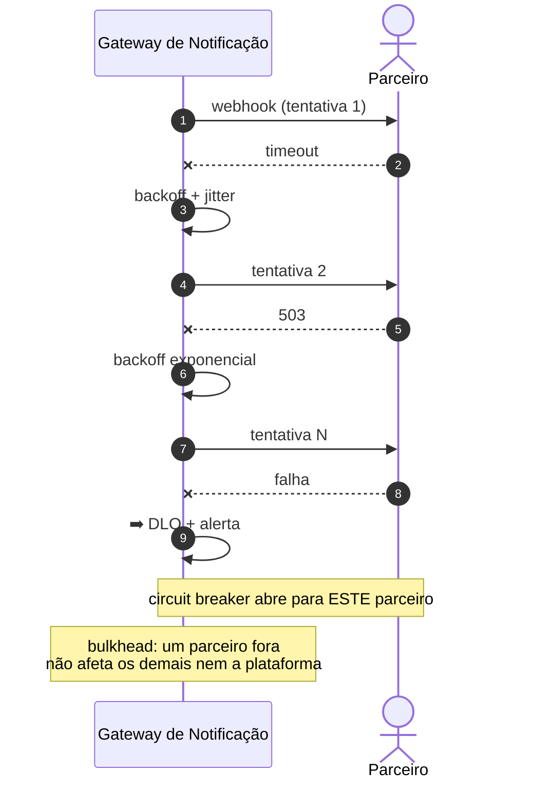
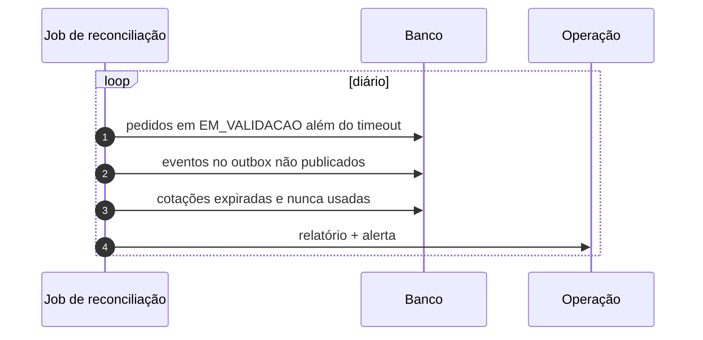

# Sequência — Mudança de status e notificação

**Slug do PRD:** pedidos-catalogo
**Escopo deste documento:** o desfecho do pedido e sua entrega ao cliente e ao parceiro, incluindo queda do relay, indisponibilidade do parceiro e reconciliação.
**Requisitos cobertos:** `P1-06`, `P1-14`, `P1-15`, `CTX-08`
**Fontes:** `ADR-0002`, `ADR-0007`, `slice/app/relay.py`, `slice/app/validador.py`
**Data:** 2026-09-22

---

## Caminho principal

---

## Leitura do diagrama

**A transição e o evento entram no mesmo commit.** Igual ao aceite: o estado nunca avança sem o evento correspondente existir. A `ADR-0002` vale para todas as transições, não só para a criação.

**O domínio recusa transição inválida.** `REJEITADO → CONFIRMADO` é barrado pelo `SELECT ... FOR UPDATE` seguido da checagem da máquina de estados — pelo domínio, não por constraint de banco.

**O webhook é assinado.** O parceiro está fora da fronteira de confiança; ele precisa poder verificar que a notificação veio de nós.

## Queda do relay entre ① e ②

**Duplicar é a escolha, não o acidente.** A ordem inversa (marcar antes de publicar) perderia o evento — e evento perdido, com a `ADR-0007`, é **venda parada**, não aviso perdido.

**O `event_id` é estável entre reentregas.** É o que torna a deduplicação possível, e por isso a obrigação de deduplicar está no contrato AsyncAPI, não em documentação à parte.

## Parceiro indisponível

**O gateway é um bulkhead.** A indisponibilidade do parceiro fica contida ali: não consome conexões de Pedidos, não enche o broker, não afeta outros parceiros. É o mecanismo de `P2-04` aplicado à fronteira mais instável do desenho.

## Reconciliação — `P1-15`

Com a `ADR-0007`, reconciliação deixou de ser opcional: pedido preso em validação é dinheiro parado e cliente sem resposta.

## O SLI que detecta a falha silenciosa

Relay parado **não quebra nada**: o aceite continua respondendo `201` e os pedidos apenas demoram mais a confirmar. A única métrica que detecta é a **idade do evento mais antigo não publicado** — implementada em `relay.idade_do_mais_antigo_pendente()` e coberta por `test_sli_de_relay_parado_detecta_pendencia`.

## Correspondência com os testes

| Cenário | Teste |
|---|---|
| Queda entre ① e ② | `test_queda_entre_publicar_e_marcar_nao_perde_evento` ⭐ |
| Deduplicação no consumidor | `test_consumidor_deduplica_a_entrega_duplicada` |
| Transição inválida recusada | `test_transicao_invalida_e_recusada_pelo_dominio` |
| SLI de relay parado | `test_sli_de_relay_parado_detecta_pendencia` |

⭐ = prova executável da `ADR-0002`.
