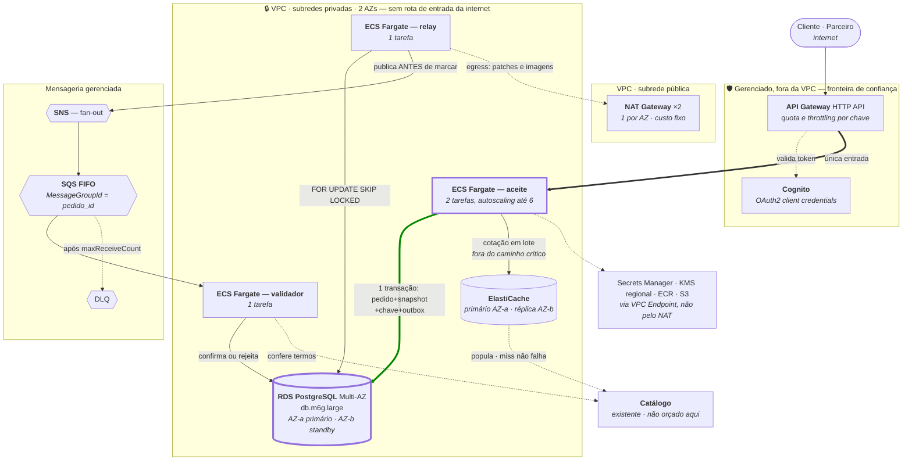

# Serviços AWS — capacidade, escolha e custo

**Slug do PRD:** pedidos-catalogo
**Escopo deste documento:** traduz cada capacidade da arquitetura em serviço AWS concreto, com tier, alternativa confrontada e custo derivado do dimensionamento. É o que faltava entre `PR-04` (*"cloud de referência: AWS"*) e o custo em faixa da estimativa.
**Requisitos cobertos:** `PR-04`, `CTX-15`, `CTX-16`, `D-05`
**Fontes:** `docs/technical-context/architecture.md`, `docs/technical-context/constraints.md` (§7), `ADR-0002`, `ADR-0006`
**Data:** 2026-09-24

---

## Por que este documento vem depois da arquitetura

A arquitetura foi escrita em **capacidades** — gateway, store transacional, broker — e nunca em produtos. Isso foi decisão do gate G2: tecnologia é consequência de restrição, não premissa dela.

O efeito colateral é que `PR-04` fixou AWS e a estimativa citou custo **sem nomear um único serviço**. Este documento fecha essa lacuna sem reabrir a arquitetura: cada linha parte de uma capacidade que já existe e de um número que já foi derivado.

> ⚠️ **Preços são ordem de grandeza**, não orçamento. Baseados em tabela pública da região `sa-east-1` (São Paulo), sob demanda, sem reserva nem savings plan. Variam por negociação, compromisso de uso e câmbio. **Precisam ser confirmados no calculadora oficial antes de virar proposta.**

---

## O dimensionamento que sustenta as escolhas

De `constraints.md` §7:

| Medida | Alvo |
|---|---|
| Pedidos/dia | 600.000 |
| Pico | 37,5 pedidos/s |
| Escritas transacionais no pico | ~190/s *(pedido + 8 itens + chave + outbox)* |
| Volume anual | ~1,1 TB |
| Eventos/dia | ~3M · ~105/s no pico |

**Estes números não justificam nada exótico.** 190 escritas/s é regime que uma instância relacional bem dimensionada atende com folga. É o tipo de constatação que evita superdimensionamento (`AV-08`).

---

## A topologia — o que roda onde

O diagrama de contêineres (`c4/containers-to-be.md`) é **lógico**: diz quem chama quem. Este é o **de implantação**: diz o que é público, o que é privado, o que é Multi-AZ e onde está a fronteira de confiança.



### O que o diagrama de implantação mostra e o lógico não

**Uma única porta de entrada.** Nada na subrede privada tem rota vinda da internet. O API Gateway é o único ponto exposto, e é onde `CTX-08` (quota por parceiro) é resolvido sem código — coerente com a fronteira `F2` do threat model.

**O SPOF tem nome e tem AZ.** O diagrama lógico diz *"banco de Pedidos é o único SPOF"*. Aqui ele vira `db.m6g.large` Multi-AZ, primário em AZ-a e standby síncrono em AZ-b. É o que transforma a afirmação de disponibilidade em configuração verificável.

**O NAT só aparece no egress, e ainda assim custa.** Nenhum fluxo de negócio passa por ele — mas ele cobra ~US$ 65/mês antes do primeiro byte. Está no diagrama justamente para não sumir da conta.

**Secrets, KMS, ECR e S3 saem por VPC Endpoint, não pelo NAT.** Decisão de custo, não de segurança: tráfego de imagem e de segredo pelo NAT é pago duas vezes.

### Cada contêiner lógico, e o serviço que o hospeda

| Contêiner em `containers-to-be.md` | Serviço AWS | Onda | No custo da onda 30? |
|---|---|---|---|
| Serviço de Pedidos *(aceite + cotação)* | ECS Fargate, 2→6 tarefas | 30 | ✅ |
| Relay do Outbox | ECS Fargate, 1 tarefa | 30 | ✅ |
| Validador assíncrono | ECS Fargate, 1 tarefa | 30 | ✅ |
| Store transacional de Pedidos | RDS PostgreSQL Multi-AZ | 30 | ✅ |
| **Cache do Catálogo** | **ElastiCache (Valkey/Redis)** | **30** | ✅ *(ver §2)* |
| Broker | SNS + SQS FIFO + DLQ | 30 | ✅ |
| Borda | API Gateway HTTP + Cognito | 30 ¹ | ✅ |
| **API Pública de Parceiros** | ECS Fargate, tarefas adicionais | **60** | ❌ — fora do escopo da fase 1 |
| **Gateway de Notificação** | ECS Fargate + SQS + DLQ | **60** | ❌ |
| **BFF multi-canal** | ECS Fargate | **90** | ❌ |
| Catálogo e seu banco | já existem | — | ❌ — não é entrega desta proposta |

¹ O API Gateway entra já na onda 30 porque a fachada síncrona `/v1` e o roteamento por versão (`ADR-0004`) dependem dele. As quotas por parceiro só passam a ser exercidas na onda 60.

> **Três contêineres do alvo não estão no custo da fase 1** — API Pública, Gateway de Notificação e BFF. Não é esquecimento: §2.5.3 limita o compromisso à fase 1, e eles são entrega das ondas 60 e 90. O acréscimo delas está estimado em ordem de grandeza no fim deste documento.


---

## 1. Store transacional de Pedidos

**Capacidade:** pedido, itens com snapshot, chave de idempotência e outbox **na mesma transação** (`ADR-0001`, `ADR-0002`, `ADR-0003`). Exige `FOR UPDATE SKIP LOCKED`.

| Alternativa | Decisão | Por quê |
|---|---|---|
| **Amazon RDS for PostgreSQL**, Multi-AZ | ✅ **Escolhido** | Atende 190 escritas/s com folga; Multi-AZ resolve o único SPOF do desenho; custo previsível |
| Amazon Aurora PostgreSQL | ❌ Rejeitado | Melhor em leitura escalável e failover mais rápido, mas **~30% mais caro** e o gargalo aqui é escrita, não leitura. Gatilho para reabrir: réplicas de leitura virarem necessidade na onda 90 |
| Aurora Serverless v2 | ❌ Rejeitado | Bom para carga intermitente; a nossa é previsível e contínua, então o prêmio de elasticidade não se paga |
| DynamoDB | ❌ Rejeitado — **incompatível** | Sem transação multi-tabela com a semântica exigida, e sem `SKIP LOCKED` para o relay. Não é preterido: não atende |

**Tier:** `db.m6g.large` (2 vCPU, 8 GB) Multi-AZ + 200 GB gp3 no primeiro ano
**Custo:** **US$ 480–620/mês** *(instância Multi-AZ ~US$ 400 + storage ~US$ 50 + backup ~US$ 30–100)*

> Crescimento: a 1,1 TB/ano, o storage passa de US$ 50 para ~US$ 250/mês no terceiro ano. É o que torna **particionamento e arquivamento** (débito `D4`) uma decisão de custo, não só de performance.

---

## 2. Cache do Catálogo

**Capacidade:** serve **a cotação** (`POST /v2/quotes`) e os atributos operacionais fora do snapshot — unidade, peso, mídia. É o componente que tira a leitura do Catálogo do caminho crítico, e portanto o que faz a conta do `CTX-17` fechar. Miss **não pode falhar a requisição** (`ADR-0003`).

| Alternativa | Decisão | Por quê |
|---|---|---|
| **ElastiCache** (Valkey/Redis), 1 primário + 1 réplica em AZ distinta | ✅ **Escolhido** | Invalidação por CDC precisa de **um lugar só** para invalidar. Réplica em outra AZ evita que a perda de uma AZ derrube a cotação junto |
| Cache em processo, dentro das tarefas de aceite | ❌ Rejeitado | Custo zero, mas **cada tarefa teria seu próprio estado**: com autoscaling de 2 a 6, a invalidação por CDC precisaria alcançar todas, e uma tarefa nova sobe fria. Preço praticado divergente entre tarefas é exatamente o que o snapshot existe para evitar |
| Read model dedicado do Catálogo | ❌ Rejeitado **nesta onda** | É a resposta certa se o cache não sustentar o p95 — e já está registrado como entrega condicional da onda 90 no `plano-30-60-90.md`. Antecipá-lo é pagar por capacidade que ainda não foi medida (`AV-08`) |
| DynamoDB como store de leitura | ❌ Rejeitado | Resolveria, mas acrescenta um modelo de dados e um runtime novos para um problema que o cache resolve com uma dependência a menos |

**Tier:** 2 nós `cache.t4g.medium` (~3 GB cada), primário e réplica em AZs distintas
**Custo:** **US$ 90–160/mês**

> ⚠️ **O tier depende do conjunto de trabalho do Catálogo, que é `???`.** Quantidade de SKUs ativos e tamanho médio do registro não constam do enunciado. O `t4g.medium` cobre da ordem de 1 a 2 milhões de SKUs com registro enxuto; um catálogo com mídia embutida ou muito maior exige subir de tier, e o custo acompanha. **É a linha deste documento com a premissa mais frágil** — está aqui dimensionada, não medida.

> **Por que o cache não é opcional nem barato de remover:** sem ele, a cotação lê o Catálogo de forma síncrona e o `CTX-17` volta — a disponibilidade composta de 99,8% contra um orçamento de 43,2 min/mês. O cache é o que mantém a cotação *fora* do caminho crítico do aceite.

---

## 3. Computação — aceite, relay e validador

**Capacidade:** três processos. O aceite é síncrono e sensível a latência; relay e validador são contínuos e tolerantes.

| Alternativa | Decisão | Por quê |
|---|---|---|
| **ECS Fargate** | ✅ **Escolhido** | Sem gerenciar nós; escala por tarefa; três serviços não pagam o custo operacional de Kubernetes |
| EKS | ❌ Rejeitado | ~US$ 73/mês só de control plane, mais o custo de operar. Gatilho para reabrir: passar de ~20 serviços, ou a conta já ter EKS |
| Lambda | ❌ Rejeitado para o aceite | Cold start compromete o p95 de 500 ms, e conexão a banco relacional exige RDS Proxy. **Viável para o relay**, que é assíncrono — mas usar dois modelos de execução para três processos não se paga |
| EC2 | ❌ Rejeitado | Volta a gerenciar sistema operacional sem ganho |

**Tier:** 2 tarefas de 0,5 vCPU / 1 GB para o aceite (autoscaling até 6), 1 tarefa para o relay, 1 para o validador
**Custo:** **US$ 90–220/mês** conforme o autoscaling

---

## 4. Broker de eventos

**Capacidade:** ~3M eventos/dia, ordenação **por agregado** (`chave_particao = pedido_id`), entrega at-least-once, DLQ.

| Alternativa | Decisão | Por quê |
|---|---|---|
| **SNS + SQS FIFO** *(fan-out com ordenação por grupo)* | ✅ **Escolhido** | `MessageGroupId = pedido_id` dá exatamente a ordenação por agregado que a `ADR-0002` exige — nem mais, nem menos. DLQ nativa. Sem cluster para operar |
| Amazon MSK (Kafka gerenciado) | ❌ Rejeitado | Entrega retenção longa, replay e throughput muito acima do necessário — e custa **~US$ 550/mês** no menor cluster de 3 brokers. **~5× o custo para capacidade que ninguém pediu** (`AV-08`) |
| MSK Serverless | ❌ Rejeitado | Elimina o cluster, mas o custo por partição-hora ainda supera SQS nesta escala |
| EventBridge | ❌ Rejeitado | Excelente para roteamento por regra; **não garante ordenação**, que aqui é requisito |

**Custo:** **US$ 25–60/mês** *(SQS FIFO ~US$ 0,50 por milhão de requisições; ~3M eventos/dia com fan-out para 2 consumidores ≈ 180M req/mês)*

> **Gatilho para reabrir:** se algum consumidor exigir **replay histórico** ou retenção além de 14 dias, SQS não atende e o MSK volta à mesa. Está registrado como gatilho na `ADR-0002`.

---

## 5. Borda e API pública

**Capacidade:** autenticação, autorização por escopo, **quotas por parceiro**, roteamento por versão (`/v1`, `/v2`).

| Alternativa | Decisão | Por quê |
|---|---|---|
| **API Gateway (HTTP API) + Cognito** | ✅ **Escolhido** | Quota e throttling **por chave de API** resolvem `CTX-08` sem código; Cognito faz OAuth2 *client credentials* para parceiros |
| ALB + autenticação na aplicação | ❌ Rejeitado | Mais barato, mas quota por parceiro viraria código nosso — e é exatamente o que `P1-16` pede pronto |
| API Gateway REST API | ❌ Rejeitado | ~3,5× o custo da HTTP API; os recursos extras (modelos, validação de request) não são necessários |

**Custo:** **US$ 40–90/mês** *(HTTP API ~US$ 1,00 por milhão; ~20M req/mês incluindo consultas)*

---

## 6. Observabilidade

**Capacidade:** tracing do caminho crítico, SLI de idade do evento mais antigo, alertas, painel comparativo entre caminhos durante a convivência.

| Alternativa | Decisão | Por quê |
|---|---|---|
| **CloudWatch + X-Ray** | ✅ **Escolhido** | Integração nativa, sem contrato novo. Atende a onda 30, que é o que está sendo orçado |
| Datadog / New Relic | ❌ Rejeitado nesta fase | Melhor experiência, mas custo por host e contrato novo não se justificam antes de o modelo operacional estar estável |
| Prometheus + Grafana gerenciados | ❌ Rejeitado | Bom custo em escala; abaixo de ~20 serviços, o esforço de montar supera o ganho |

**Custo:** **US$ 120–350/mês** — **a linha mais volátil**, porque depende de retenção e de volume de log. Ingestão a ~US$ 0,57/GB domina a conta.

---

## 7. Rede e apoio

| Item | Serviço | Custo |
|---|---|---|
| NAT Gateway | 1 por AZ, 2 AZs | **US$ 70–110/mês** *(US$ 0,045/h + US$ 0,045/GB)* |
| Secrets Manager | chave HMAC da cotação (`ADR-0005`), credenciais | **US$ 2–5/mês** |
| KMS | chaves **regionais** (`ADR-0006`) | **US$ 2–6/mês** |
| S3 | arquivamento de outbox expurgado, backup lógico | **US$ 5–25/mês** |
| ECR | imagens dos três serviços | **US$ 1–3/mês** |

> **NAT Gateway surpreende em proposta.** São ~US$ 65/mês só de hora, antes de qualquer tráfego, e some na conta se ninguém olhar. Onde couber, **VPC Endpoints** para S3 e Secrets Manager reduzem o tráfego que passa por ele.

---

## Consolidado

| Componente | Serviço | Mín. | Máx. |
|---|---|---|---|
| Store transacional | RDS PostgreSQL Multi-AZ, `db.m6g.large` | 480 | 620 |
| Cache do Catálogo | ElastiCache, 2 nós `cache.t4g.medium` | 90 | 160 |
| Computação | ECS Fargate, 4 tarefas | 90 | 220 |
| Broker | SNS + SQS FIFO | 25 | 60 |
| Borda | API Gateway HTTP + Cognito | 40 | 90 |
| Observabilidade | CloudWatch + X-Ray | 120 | 350 |
| Rede e apoio | NAT, Secrets, KMS, S3, ECR | 80 | 149 |
| | **Total mensal** | **US$ 925** | **US$ 1.649** |

### Isto corrige a estimativa anterior

`estimativa-fase1.md` §4.2 projetava **US$ 1.700–3.700/mês** com componentes genéricos. Com os serviços nomeados e dimensionados, o número real fica em **US$ 925–1.649** — a faixa anterior era conservadora **por falta de especificidade**, não por prudência.

A diferença vem quase toda de duas escolhas:

| | Faixa anterior presumia | Escolha real | Economia |
|---|---|---|---|
| Broker | Kafka gerenciado (MSK) | SNS + SQS FIFO | ~US$ 500/mês |
| Banco | Aurora | RDS Multi-AZ | ~US$ 200/mês |

**Nos dois casos, a opção mais cara entregava capacidade que o dimensionamento não pede.** É o mesmo raciocínio de `AV-08` aplicado a custo: pagar por replay histórico e por leitura escalável antes de alguém precisar é superdimensionamento com recibo mensal.

---

## Custo por pedido

```
US$ 925–1.649/mês ÷ (600.000 pedidos/dia × 30)
= US$ 0,000051 a 0,000092 por pedido
≈ R$ 0,00028 a 0,00050 (a R$ 5,40/US$)
```

**Menos de meio centavo por pedido.** Isso responde a perna (e) da hipótese do PRD — *"o ganho de escala não exige crescimento proporcional de infraestrutura"* — e mostra que `CTX-16` é atendível: a maior parte do custo é **fixo** (Multi-AZ, NAT, control planes), não por transação.

> `CTX-15`, o **teto de custo**, permanece `???`. É decisão do cliente (`V7`), e sem ele não há como afirmar que o número cabe no orçamento — apenas que é proporcionado ao volume.

---

## O que muda nas ondas 60 e 90

Não orçado — §2.5.3 limita o compromisso à fase 1. Registrado para que a conversa de custo não termine no número da onda 30:

| Onda | Acréscimo | Impacto |
|---|---|---|
| 60 | **API Pública de Parceiros** e **Gateway de Notificação** — tarefas Fargate adicionais, fila e DLQ próprias, mais tráfego na borda | **+15 a 25%** |
| 90 | **Segunda região** (`ADR-0006`): RDS, ECS, NAT e observabilidade duplicados na região dos EUA | **+70 a 90%** — o salto real |
| 90 | **BFF multi-canal** — tarefas Fargate adicionais | **+5 a 10%** |
| 90 | Escala 10× | pouco em fixo, mais em I/O e ingestão de log; o **cache sobe de tier** ou vira read model |

**O salto de custo é a onda 90, não a 30.** Multi-região duplica quase toda a infraestrutura fixa. Isso precisa estar claro antes de alguém aprovar as três ondas olhando só o número da primeira.

---

## Premissas

| # | Premissa | Se falsa |
|---|---|---|
| A1 | Região `sa-east-1`, sob demanda, sem reserva | Reserva de 1 ano reduz computação e banco em **~30%** |
| A2 | Conta AWS existente, com rede e landing zone prontas | +custo de provisionamento inicial |
| A3 | Retenção de log de 90 dias, alinhada ao expurgo do outbox | Retenção maior domina a conta de observabilidade |
| A4 | 2 AZs, não 3 | 3 AZs adicionam ~US$ 35/mês de NAT |
| A5 | Tráfego de saída moderado | Egress a US$ 0,09/GB pode surpreender com webhooks volumosos |
| A6 | **Conjunto de trabalho do Catálogo cabe em ~3 GB** — nº de SKUs ativos é `???` | Catálogo muito maior ou com mídia embutida exige subir o tier do ElastiCache |
| A7 | O Catálogo e seu banco **já existem e não são orçados aqui** | Se a proposta tiver de hospedá-los também, a conta muda de patamar |

## Riscos

1. **Observabilidade é a linha mais volátil.** Ingestão de log domina, e log verboso em rollout progressivo pode dobrar a conta justamente no mês mais caro.
2. **NAT Gateway é custo fixo que ninguém lembra.** ~US$ 65/mês antes de qualquer tráfego.
3. **Preços mudam e variam por negociação.** Nenhum número aqui substitui a calculadora oficial.
4. **A escolha SQS sobre MSK assume que ninguém pedirá replay histórico.** Se pedir, o custo do broker sobe ~5×.
5. **O tier do cache é o número menos ancorado do documento.** Depende do tamanho do Catálogo, que é `???`. Subir dois tiers triplica essa linha — e ela é a segunda maior depois do banco.

## Pendências registradas

- Confirmar todos os valores na calculadora oficial antes de virar proposta.
- `CTX-15` (teto de custo) segue `???` — decisão `V7`.
- A escolha de região para a operação dos EUA depende de `V10`.
- **Dimensionar o cache exige o nº de SKUs ativos e o tamanho médio do registro do Catálogo** (`A6`). É a primeira medição a pedir junto com o baseline `P1`.
