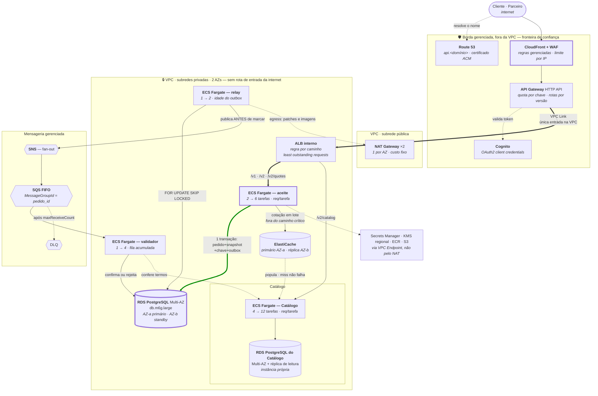

# Serviços AWS — capacidade, escolha e custo

**Slug do PRD:** pedidos-catalogo
**Escopo deste documento:** traduz cada capacidade da arquitetura em serviço AWS concreto, com tier, alternativa confrontada e custo derivado do dimensionamento. É o que faltava entre `PR-04` (*"cloud de referência: AWS"*) e o custo em faixa da estimativa.
**Requisitos cobertos:** `PR-04`, `CTX-15`, `CTX-16`, `D-05`
**Fontes:** `docs/technical-context/architecture.md`, `docs/technical-context/constraints.md` (§7), `ADR-0002`, `ADR-0006`
**Data:** 2026-09-24

---

## Por que este documento vem depois da arquitetura

A arquitetura foi escrita em **capacidades** — gateway, store transacional, broker — e nunca em produtos. Isso foi decisão do gate G2: tecnologia é consequência de restrição, não premissa dela.

O efeito colateral é que `PR-04` fixou AWS e a estimativa citou custo **sem nomear um único serviço**. Este documento fecha essa lacuna sem reabrir a arquitetura: cada linha parte de uma capacidade que já existe e de um número que já foi derivado.

> ⚠️ **Preços são ordem de grandeza**, não orçamento. Baseados em tabela pública da região `sa-east-1` (São Paulo), sob demanda, sem reserva nem savings plan. Variam por negociação, compromisso de uso e câmbio. **Precisam ser confirmados no calculadora oficial antes de virar proposta.**

---

## O dimensionamento que sustenta as escolhas

De `constraints.md` §7:

| Medida | Alvo |
|---|---|
| Pedidos/dia | 600.000 |
| Pico | 37,5 pedidos/s |
| Escritas transacionais no pico | ~190/s *(pedido + 8 itens + chave + outbox)* |
| Volume anual | ~1,1 TB |
| Eventos/dia | ~3M · ~105/s no pico |

**Estes números não justificam nada exótico.** 190 escritas/s é regime que uma instância relacional bem dimensionada atende com folga. É o tipo de constatação que evita superdimensionamento (`AV-08`).

---

## A topologia — o que roda onde

O diagrama de contêineres (`c4/containers-to-be.md`) é **lógico**: diz quem chama quem. Este é o **de implantação**: diz o que é público, o que é privado, o que é Multi-AZ e onde está a fronteira de confiança.



### O que o diagrama de implantação mostra e o lógico não

**Uma única porta de entrada.** Nada na subrede privada tem rota vinda da internet. A entrada é uma só — CloudFront, API Gateway, VPC Link, ALB interno — e é no API Gateway que `CTX-08` (quota por parceiro) é resolvido sem código, coerente com a fronteira `F2` do threat model.

**O SPOF tem nome e tem AZ.** O diagrama lógico diz *"banco de Pedidos é o único SPOF"*. Aqui ele vira `db.m6g.large` Multi-AZ, primário em AZ-a e standby síncrono em AZ-b. É o que transforma a afirmação de disponibilidade em configuração verificável.

**O NAT só aparece no egress, e ainda assim custa.** Nenhum fluxo de negócio passa por ele — mas ele cobra ~US$ 65/mês antes do primeiro byte. Está no diagrama justamente para não sumir da conta.

**Secrets, KMS, ECR e S3 saem por VPC Endpoint, não pelo NAT.** Decisão de custo, não de segurança: tráfego de imagem e de segredo pelo NAT é pago duas vezes.

**Catálogo e Pedidos dividem região, VPC e subredes — não dividem banco.** Não há seta entre os dois RDS, e é de propósito: Pedidos só alcança o Catálogo pelo cache e pelo validador, nunca pelo dado. O porquê está em §8.

### Da internet até a tarefa

Três camadas de roteamento, cada uma decidindo uma coisa:

| Camada | Decide | Como |
|---|---|---|
| **Route 53** | para qual **entrada** a chamada vai | zona pública; `api.<domínio>` é alias para o CloudFront, com certificado do ACM |
| **API Gateway** | qual **serviço e versão** atende | `/v1/orders`, `/v2/orders` e `/v2/quotes` vão para o aceite; `/v2/catalog`, para o Catálogo — todas pelo VPC Link |
| **ALB interno** | qual **tarefa** atende | regra por caminho escolhe o target group; o algoritmo escolhe a tarefa |

Uma **zona privada** do Route 53 dá nome estável ao ALB interno (`catalogo.interno`) para as chamadas entre serviços — validador e cache alcançam o Catálogo sem endereço de balanceador no código.

**Por que ALB entre o API Gateway e as tarefas.** O API Gateway não alcança tarefas Fargate em subrede privada sem um alvo de VPC Link. Das três opções que ele aceita, o ALB é a única que atende `CTX-11`:

| Alvo do VPC Link | Decisão | Por quê |
|---|---|---|
| **ALB interno** | ✅ **Escolhido** | health check por HTTP, **drenagem de conexões** no deploy, regra por caminho — um ALB serve aceite e Catálogo |
| NLB | ❌ Rejeitado | camada 4: sem regra por caminho, health check mais pobre |
| Cloud Map, sem balanceador | ❌ Rejeitado | mais barato, mas sem drenagem — cada deploy cortaria requisições em andamento, e a restrição é **zero janela de indisponibilidade** |

**Distribuição.** *Least outstanding requests*: a chamada vai para a tarefa com menos requisições em andamento. Round-robin distribui por contagem e ignora que um pedido de 15 itens pesa mais que um de 1. Tarefas nas duas AZs, com balanceamento entre zonas; tarefa que falha no health check sai da rotação antes de receber tráfego.

**Autoscaling, por serviço — cada um pela métrica que representa a sua carga:**

| Serviço | Mín. → máx. | Escala por | Por quê |
|---|---|---|---|
| **Aceite** | 2 → 6 | requisições por tarefa no ALB; CPU a 60% como segunda regra | tráfego síncrono. O mínimo de 2 é disponibilidade — uma tarefa por AZ —, não carga |
| **Catálogo** | 4 → 12 | requisições por tarefa no ALB | leitura pura, 338 req/s no pico com o N+1 |
| **Validador** | 1 → 4 | mensagens acumuladas na fila, por tarefa | consumidor de fila escala pelo acúmulo, não pela CPU |
| **Relay** | 1 → 2 | idade do evento mais antigo no outbox | é o SLI de `A11.1`; o `SKIP LOCKED` permite duas instâncias sem trabalho duplicado |

Escala para cima em 60 s e para baixo em 300 s, para não oscilar em rajada. O alvo exato de requisições por tarefa depende da vazão real por tarefa, que só o teste de carga mede — está no plano da onda 90 como *"autoscaling calibrado"*; até lá, o valor é declarado como inicial.

**O limite que costuma faltar:** conexões por tarefa × tarefas no máximo ≤ metade do `max_connections` do RDS. Com 6 tarefas e pool de 20, são 120 conexões — folgado num `db.m6g.large`. Sem essa conta, escalar a aplicação derruba o banco, que é o único componente que para o aceite. A divisão do pool está em [`resiliencia.md`](resiliencia.md).

**Deploy sem janela.** Rolling update com mínimo de 100% saudável e máximo de 200% — a versão nova sobe antes de a antiga sair —, drenagem de 30 s no ALB e *deployment circuit breaker* do ECS, que reverte sozinho um deploy com falha. A feature flag reverte comportamento; isto garante que trocar a versão não derruba ninguém.

### Na onda 90: duas regiões, roteamento por domicílio

A `ADR-0006` exige roteamento **por domicílio do titular, não por geografia da requisição**. Isso proíbe usar geolocalização ou latência do Route 53 para decidir a região do dado:

- **Entrada:** `api.<domínio>` com roteamento por latência leva à região mais próxima — só desempenho.
- **Região do dado:** vem da **identidade**. O token carrega a região de domicílio do titular; chamada que chega à região errada é encaminhada ao endereço da região certa (`api-br.<domínio>`, `api-us.<domínio>`).
- **Parceiros:** usam o endereço da região fixado em contrato.
- **Sem failover automático entre regiões para dado pessoal.** Desviar o tráfego de uma região caída para a outra processaria dado brasileiro nos EUA — transferência internacional sem instrumento. A continuidade é **dentro da região**: Multi-AZ e backup regional.

### Cada contêiner lógico, e o serviço que o hospeda

| Contêiner em `containers-to-be.md` | Serviço AWS | Onda | No custo da onda 30? |
|---|---|---|---|
| Serviço de Pedidos *(aceite + cotação)* | ECS Fargate, 2→6 tarefas | 30 | ✅ |
| Relay do Outbox | ECS Fargate, 1 tarefa | 30 | ✅ |
| Validador assíncrono | ECS Fargate, 1 tarefa | 30 | ✅ |
| Store transacional de Pedidos | RDS PostgreSQL Multi-AZ | 30 | ✅ |
| **Cache do Catálogo** | **ElastiCache (Valkey/Redis)** | **30** | ✅ *(ver §2)* |
| Broker | SNS + SQS FIFO + DLQ | 30 | ✅ |
| Borda | API Gateway HTTP + Cognito | 30 ¹ | ✅ |
| **API Pública de Parceiros** | ECS Fargate, tarefas adicionais | **60** | ❌ — fora do escopo da fase 1 |
| **Gateway de Notificação** | ECS Fargate + SQS + DLQ | **60** | ❌ |
| **BFF multi-canal** | ECS Fargate | **90** | ❌ |
| **Catálogo e seu banco** | ECS Fargate + RDS Multi-AZ **com réplica de leitura** | 30 | ✅ *(ver §8)* |

¹ O API Gateway entra já na onda 30 porque a fachada síncrona `/v1` e o roteamento por versão (`ADR-0004`) dependem dele. As quotas por parceiro só passam a ser exercidas na onda 60.

> **Três contêineres do alvo não estão no custo da fase 1** — API Pública, Gateway de Notificação e BFF. Não é esquecimento: §2.5.3 limita o compromisso à fase 1, e eles são entrega das ondas 60 e 90. O acréscimo delas está estimado em ordem de grandeza no fim deste documento.


---

## 1. Store transacional de Pedidos

**Capacidade:** pedido, itens com snapshot, chave de idempotência e outbox **na mesma transação** (`ADR-0001`, `ADR-0002`, `ADR-0003`). Exige `FOR UPDATE SKIP LOCKED`.

| Alternativa | Decisão | Por quê |
|---|---|---|
| **Amazon RDS for PostgreSQL**, Multi-AZ | ✅ **Escolhido** | Atende 190 escritas/s com folga; Multi-AZ resolve o único SPOF do desenho; custo previsível |
| Amazon Aurora PostgreSQL | ❌ Rejeitado | Melhor em leitura escalável e failover mais rápido, mas **~30% mais caro** e o gargalo aqui é escrita, não leitura. Gatilho para reabrir: réplicas de leitura virarem necessidade na onda 90 |
| Aurora Serverless v2 | ❌ Rejeitado | Bom para carga intermitente; a nossa é previsível e contínua, então o prêmio de elasticidade não se paga |
| DynamoDB | ❌ Rejeitado — **incompatível** | Sem transação multi-tabela com a semântica exigida, e sem `SKIP LOCKED` para o relay. Não é preterido: não atende |

**Tier:** `db.m6g.large` (2 vCPU, 8 GB) Multi-AZ + 200 GB gp3 no primeiro ano
**Custo:** **US$ 480–620/mês** *(instância Multi-AZ ~US$ 400 + storage ~US$ 50 + backup ~US$ 30–100)*

> Crescimento: a 1,1 TB/ano, o storage passa de US$ 50 para ~US$ 250/mês no terceiro ano. É o que torna **particionamento e arquivamento** (débito `D4`) uma decisão de custo, não só de performance.

---

## 2. Cache do Catálogo

**Capacidade:** serve **a cotação** (`POST /v2/quotes`) e os atributos operacionais fora do snapshot — unidade, peso, mídia. É o componente que tira a leitura do Catálogo do caminho crítico, e portanto o que faz a conta do `CTX-17` fechar. Miss **não pode falhar a requisição** (`ADR-0003`).

| Alternativa | Decisão | Por quê |
|---|---|---|
| **ElastiCache** (Valkey/Redis), 1 primário + 1 réplica em AZ distinta | ✅ **Escolhido** | A invalidação precisa de **um lugar só** para apagar a chave. Réplica em outra AZ evita que a perda de uma AZ derrube a cotação junto |
| Cache em processo, dentro das tarefas de Pedidos | ❌ Rejeitado | Custo zero, mas **cada tarefa teria seu próprio estado**: com autoscaling de 2 a 6, a invalidação precisaria alcançar todas, e uma tarefa nova sobe fria. Preço praticado divergente entre tarefas é exatamente o que o snapshot existe para evitar |
| Read model dedicado do Catálogo | ❌ Rejeitado **nesta onda** | É a resposta certa se o cache não sustentar o p95 — e já está registrado como entrega condicional da onda 90 no `plano-30-60-90.md`. Antecipá-lo é pagar por capacidade que ainda não foi medida (`AV-08`) |
| DynamoDB como store de leitura | ❌ Rejeitado | Resolveria, mas acrescenta um modelo de dados e um runtime novos para um problema que o cache resolve com uma dependência a menos |

**Tier:** 2 nós `cache.t4g.medium` (~3 GB cada), primário e réplica em AZs distintas
**Custo:** **US$ 90–160/mês**

> ⚠️ **O tier depende do conjunto de trabalho do Catálogo, que é `???`.** Quantidade de SKUs ativos e tamanho médio do registro não constam do enunciado. O `t4g.medium` cobre da ordem de 1 a 2 milhões de SKUs com registro enxuto; um catálogo com mídia embutida ou muito maior exige subir de tier, e o custo acompanha. **É a linha deste documento com a premissa mais frágil** — está aqui dimensionada, não medida.

### Invalidação — quando um preço muda

Preço velho no cache não é só dado desatualizado: **a cotação assinada é honrada** (`ADR-0007`). Se o cache servir o preço antigo, a empresa vende por ele durante toda a validade da cotação. Por isso a invalidação tem três camadas:

| Camada | Como | Quando entra |
|---|---|---|
| **TTL de 5 minutos** | toda entrada expira sozinha; uma invalidação perdida se corrige em até 5 min | onda 30 — é configuração |
| **Evento `PrecoAlterado`** | o Catálogo publica a mudança pelo mesmo padrão de outbox da `ADR-0002`; um consumidor apaga a chave no cache | onda 60, quando o Catálogo já é alterado para a leitura em lote |
| **Leitura no miss** | a cotação busca os SKUs ausentes em lote, na réplica de leitura do Catálogo, e repopula o cache | desde a onda 30 — fora do caminho de criação do pedido |

**Exposição máxima a preço antigo: 5 min de TTL + 30 min de validade da cotação.** Precisa do aceite do negócio, junto com a validade da cotação — que já é pendência da `ADR-0007`.

| Alternativa de invalidação | Decisão | Por quê |
|---|---|---|
| **Evento de domínio publicado pelo Catálogo + TTL** | ✅ **Escolhida** | o Catálogo decide o que é mudança de preço; Pedidos não conhece o schema dele |
| CDC lendo as tabelas do Catálogo | ❌ Rejeitada | acopla ao **schema interno**: o Catálogo renomeia uma coluna e a invalidação quebra em silêncio |
| Só TTL | ❌ Rejeitada como estado final | simples, mas toda mudança de preço espera o TTL inteiro. Serve de ponto de partida na onda 30 |
| Catálogo apagando a chave direto no cache, ao gravar | ❌ Rejeitada | escrita dupla — banco e cache — sem garantia de que a segunda acontece. É o problema que o outbox resolve |

> **Por que o cache não é opcional nem barato de remover:** sem ele, a cotação lê o Catálogo de forma síncrona e o `CTX-17` volta — a disponibilidade composta de 99,8% contra um orçamento de 43,2 min/mês. O cache é o que mantém a cotação *fora* do caminho crítico do aceite.

---

## 3. Computação — aceite, relay e validador

**Capacidade:** três processos. O aceite é síncrono e sensível a latência; relay e validador são contínuos e tolerantes.

| Alternativa | Decisão | Por quê |
|---|---|---|
| **ECS Fargate** | ✅ **Escolhido** | Sem gerenciar nós; escala por tarefa; três serviços não pagam o custo operacional de Kubernetes |
| EKS | ❌ Rejeitado | ~US$ 73/mês só de control plane, mais o custo de operar. Gatilho para reabrir: passar de ~20 serviços, ou a conta já ter EKS |
| Lambda | ❌ Rejeitado para o aceite | Cold start compromete o p95 de 500 ms, e conexão a banco relacional exige RDS Proxy. **Viável para o relay**, que é assíncrono — mas usar dois modelos de execução para três processos não se paga |
| EC2 | ❌ Rejeitado | Volta a gerenciar sistema operacional sem ganho |

**Tier:** 2 tarefas de 0,5 vCPU / 1 GB para o aceite (autoscaling até 6), 1 tarefa para o relay, 1 para o validador
**Custo:** **US$ 90–220/mês** conforme o autoscaling

---

## 4. Broker de eventos

**Capacidade:** ~3M eventos/dia, ordenação **por agregado** (`chave_particao = pedido_id`), entrega at-least-once, DLQ.

| Alternativa | Decisão | Por quê |
|---|---|---|
| **SNS + SQS FIFO** *(fan-out com ordenação por grupo)* | ✅ **Escolhido** | `MessageGroupId = pedido_id` dá exatamente a ordenação por agregado que a `ADR-0002` exige — nem mais, nem menos. DLQ nativa. Sem cluster para operar |
| Amazon MSK (Kafka gerenciado) | ❌ Rejeitado | Entrega retenção longa, replay e throughput muito acima do necessário — e custa **~US$ 550/mês** no menor cluster de 3 brokers. **~5× o custo para capacidade que ninguém pediu** (`AV-08`) |
| MSK Serverless | ❌ Rejeitado | Elimina o cluster, mas o custo por partição-hora ainda supera SQS nesta escala |
| EventBridge | ❌ Rejeitado | Excelente para roteamento por regra; **não garante ordenação**, que aqui é requisito |

**Custo:** **US$ 25–60/mês** *(SQS FIFO ~US$ 0,50 por milhão de requisições; ~3M eventos/dia com fan-out para 2 consumidores ≈ 180M req/mês)*

> **Gatilho para reabrir:** se algum consumidor exigir **replay histórico** ou retenção além de 14 dias, SQS não atende e o MSK volta à mesa. Está registrado como gatilho na `ADR-0002`.

---

## 5. Borda e API pública

**Capacidade:** autenticação, autorização por escopo, **quotas por parceiro**, roteamento por versão (`/v1`, `/v2`).

| Alternativa | Decisão | Por quê |
|---|---|---|
| **API Gateway (HTTP API) + Cognito** | ✅ **Escolhido** | Quota e throttling **por chave de API** resolvem `CTX-08` sem código; Cognito faz OAuth2 *client credentials* para parceiros |
| ALB público + autenticação na aplicação, **no lugar** do API Gateway | ❌ Rejeitado | Mais barato, mas quota por parceiro viraria código nosso — e é exatamente o que `P1-16` pede pronto. O ALB **interno**, atrás do API Gateway, existe e é outra coisa |
| API Gateway REST API | ❌ Rejeitado | ~3,5× o custo da HTTP API; os recursos extras (modelos, validação de request) não são necessários |

### WAF

A API é pública para parceiros, e o **AWS WAF não se associa a HTTP API** — só a REST API, ALB e CloudFront.

| Alternativa | Decisão | Por quê |
|---|---|---|
| **CloudFront + WAF na frente do API Gateway** | ✅ **Escolhido** | regras gerenciadas, limite por IP e bloqueio geográfico, sem trocar o tipo de API |
| Trocar para REST API | ❌ Rejeitado | WAF nativo, mas ~3,5× o custo do gateway |
| Só o throttling do API Gateway | ❌ Rejeitado | limita volume, não filtra conteúdo — para API aberta a terceiros, é a lacuna que primeiro aparece |

> **O WAF só protege se a origem não for alcançável por fora dele.** O endpoint padrão `execute-api` é desativado, e o CloudFront envia à origem um cabeçalho secreto, rotacionado, sem o qual a chamada é recusada. Sem isso, quem descobrir o endereço regional do API Gateway contorna o WAF.

**Custo da borda:**

| Item | US$/mês |
|---|---|
| API Gateway HTTP API + Cognito *(~US$ 1,00 por milhão; ~20M req/mês)* | 40–90 |
| CloudFront + WAF *(web ACL, regras gerenciadas, requisições)* | 15–40 |
| ALB interno *(hora + LCU)* | 20–40 |
| Route 53 *(zona pública e privada, consultas)* | 2–5 |
| **Total** | **US$ 77–175** |

---

## 6. Observabilidade

**Capacidade:** tracing do caminho crítico, SLI de idade do evento mais antigo, alertas, painel comparativo entre caminhos durante a convivência.

| Alternativa | Decisão | Por quê |
|---|---|---|
| **CloudWatch + X-Ray** | ✅ **Escolhido** | Integração nativa, sem contrato novo. Atende a onda 30, que é o que está sendo orçado |
| Datadog / New Relic | ❌ Rejeitado nesta fase | Melhor experiência, mas custo por host e contrato novo não se justificam antes de o modelo operacional estar estável |
| Prometheus + Grafana gerenciados | ❌ Rejeitado | Bom custo em escala; abaixo de ~20 serviços, o esforço de montar supera o ganho |

**Custo:** **US$ 120–350/mês** — **a linha mais volátil**, porque depende de retenção e de volume de log. Ingestão a ~US$ 0,57/GB domina a conta.

---

## 7. Rede e apoio

| Item | Serviço | Custo |
|---|---|---|
| NAT Gateway | 1 por AZ, 2 AZs | **US$ 70–110/mês** *(US$ 0,045/h + US$ 0,045/GB)* |
| Secrets Manager | chave HMAC da cotação (`ADR-0005`), credenciais | **US$ 2–5/mês** |
| KMS | chaves **regionais** (`ADR-0006`) | **US$ 2–6/mês** |
| S3 | arquivamento de outbox expurgado, backup lógico | **US$ 5–25/mês** |
| ECR | imagens dos três serviços | **US$ 1–3/mês** |

> **NAT Gateway surpreende em proposta.** São ~US$ 65/mês só de hora, antes de qualquer tráfego, e some na conta se ninguém olhar. Onde couber, **VPC Endpoints** para S3 e Secrets Manager reduzem o tráfego que passa por ele.

---

## 8. Catálogo

O Catálogo **já roda na mesma infraestrutura que Pedidos e continua nela** (`V11`, decidida). É orçado aqui, e não tratado como infraestrutura de terceiro, por três razões:

**O enunciado nomeia a plataforma como "Pedidos e Catálogo".** Orçar metade do escopo nomeado e chamar de custo de infraestrutura da proposta responde outra pergunta.

**A proposta mexe no Catálogo.** A resolução em lote da onda 60 — *9 chamadas → 2* (`CTX-05`) — é trabalho **dentro** dele. Não dá para mudar um serviço na onda 60 e afirmar que ele não faz parte da entrega.

**O `CTX-17` depende da disponibilidade dele.** A derivação inteira — 99,9% × 99,9% = 99,8% — exige 99,9% do Catálogo. Exigir disponibilidade de um componente cuja infraestrutura não foi dimensionada é transferir o problema, não resolvê-lo: é a saída nº 1 que `constraints.md` §8 rejeita.

### Mesma região e mesma VPC, banco separado

O Catálogo roda na **mesma região, na mesma VPC e nas mesmas subredes privadas** que Pedidos. Não há razão para separá-los na rede: a latência entre os dois fica mínima e a fronteira de confiança é uma só. Na onda 90, os dois vão juntos para a segunda região.

**O banco é que não se compartilha.** Colocar o Catálogo na instância de Pedidos economizaria uma linha da conta e custaria três coisas:

1. **Devolveria ao aceite a dependência que a arquitetura tirou dele.** O banco de Pedidos é o **único** componente que derruba a criação de pedido — e foi isolado para isso. Na mesma instância, as leituras do Catálogo disputam CPU, I/O e conexões com a transação do aceite: um pico de cotação, uma consulta pesada ou uma campanha derrubaria o aceite **pela infraestrutura**, sem uma única chamada entre os serviços. O `CTX-17` voltaria por baixo.
2. **As cargas são opostas.** Pedidos é escrita transacional (~190/s no pico); o Catálogo é leitura quase pura (338 req/s, 600 no p95). Uma instância que atendesse os dois precisaria ser dimensionada para a soma — e a réplica de leitura, que só o Catálogo pede, passaria a carregar o banco inteiro. O que se economizaria numa instância se gastaria no tier da outra.
3. **Banco compartilhado vira contrato não declarado.** Com as tabelas ao alcance, alguém faz o primeiro `JOIN` entre contextos, e daí em diante o schema de um só muda com a permissão do outro. O snapshot da `ADR-0003` existe justamente para Pedidos não depender do dado do Catálogo em tempo de leitura; dividir a instância desfaria isso na infraestrutura.


### O dimensionamento

De `constraints.md` §7, a carga do Catálogo:

| Medida | Alvo |
|---|---|
| Carga com N+1 *(8 itens)* | **~338 req/s** |
| Carga com N+1 *(p95, 15 itens)* | **~600 req/s** |
| Carga com lote, após a onda 60 | ~75 req/s |

**O Catálogo recebe ~27× mais requisições que Pedidos** e é leitura quase pura. Isso inverte o dimensionamento: onde Pedidos precisa de transação, o Catálogo precisa de **capacidade de leitura**.

| Componente | Serviço | Tier | US$/mês |
|---|---|---|---|
| Computação | ECS Fargate | 4 tarefas de 1 vCPU / 2 GB, autoscaling até 12 | **150–400** |
| Store | RDS PostgreSQL Multi-AZ **+ 1 réplica de leitura** | `db.m6g.large` | **700–900** |
| | | **Subtotal** | **US$ 850–1.300** |

> **A réplica de leitura é a diferença de desenho.** No Pedidos ela foi rejeitada — o gargalo é escrita, e Aurora custaria 30% a mais por capacidade que ninguém pede. No Catálogo a conclusão se inverte: a 338 req/s de leitura, a réplica é o que evita subir a instância inteira. **É a mesma análise chegando a respostas opostas porque o perfil de carga é oposto.**

> **O dimensionamento acima é da onda 30, com o N+1 ainda de pé.** Depois da onda 60 a carga cai 78%, e esta é a única linha do documento que **encolhe** com a evolução. A réplica pode então ser reavaliada.

### O que isto muda além do custo

**Nenhum esforço de migração.** Como o Catálogo já roda nessa infraestrutura, a onda 30 não o move nem assume a operação dele: as dias-pessoa estimadas — 63 com IA, 79 sem — cobrem idempotência, outbox e snapshot, e o trabalho dentro do Catálogo começa na onda 60, com a resolução em lote.

---

## Consolidado

| Componente | Serviço | Mín. | Máx. |
|---|---|---|---|
| Store transacional | RDS PostgreSQL Multi-AZ, `db.m6g.large` | 480 | 620 |
| Cache do Catálogo | ElastiCache, 2 nós `cache.t4g.medium` | 90 | 160 |
| Computação | ECS Fargate, 4 tarefas | 90 | 220 |
| Broker | SNS + SQS FIFO | 25 | 60 |
| Borda | CloudFront + WAF, API Gateway HTTP + Cognito, ALB interno, Route 53 | 77 | 175 |
| Observabilidade | CloudWatch + X-Ray | 120 | 350 |
| Rede e apoio | NAT, Secrets, KMS, S3, ECR | 80 | 149 |
| | **Subtotal — Pedidos** | **US$ 962** | **US$ 1.734** |
| | | | |
| Catálogo — computação | ECS Fargate, 4→12 tarefas | 150 | 400 |
| Catálogo — store | RDS PostgreSQL Multi-AZ + réplica de leitura | 700 | 900 |
| | **Subtotal — Catálogo** | **US$ 850** | **US$ 1.300** |
| | **Total — plataforma** | **US$ 1.812** | **US$ 3.034** |

**O Catálogo é quase metade da conta** e é leitura: a linha que mais pesa é a réplica que sustenta os 338 req/s do N+1 — e a única que encolhe depois da onda 60.

### Onde o dimensionamento evitou gasto

Duas escolhas respondem por ~US$ 700/mês, e as duas seguem o mesmo raciocínio:

| | Alternativa mais cara | Escolha | Diferença |
|---|---|---|---|
| Broker | Kafka gerenciado (MSK) | SNS + SQS FIFO | ~US$ 500/mês |
| Banco de Pedidos | Aurora | RDS Multi-AZ | ~US$ 200/mês |

**Nos dois casos, a opção mais cara entregava capacidade que o dimensionamento não pede** — replay histórico e leitura escalável antes de alguém precisar. É `AV-08` aplicado a custo: superdimensionamento com recibo mensal.

---

## Custo por pedido

```
US$ 1.812–3.034/mês ÷ 18.000.000 pedidos/mês
= US$ 0,000101 a 0,000169   ≈  R$ 0,00054 a 0,00091
```

**Menos de meio centavo por pedido.** Isso responde a perna (e) da hipótese do PRD — *"o ganho de escala não exige crescimento proporcional de infraestrutura"* — e mostra que `CTX-16` é atendível: a maior parte do custo é **fixo** (Multi-AZ, NAT, control planes), não por transação.

> `CTX-15`, o **teto de custo**, permanece `???`. É decisão do cliente (`V7`), e sem ele não há como afirmar que o número cabe no orçamento — apenas que é proporcionado ao volume.

---

## O que muda nas ondas 60 e 90

Não orçado — §2.5.3 limita o compromisso à fase 1. Registrado para que a conversa de custo não termine no número da onda 30:

| Onda | Acréscimo | Impacto |
|---|---|---|
| 60 | **API Pública de Parceiros** e **Gateway de Notificação** — tarefas Fargate adicionais, fila e DLQ próprias, mais tráfego na borda | **+15 a 25%** |
| 90 | **Segunda região** (`ADR-0006`): RDS, ECS, NAT e observabilidade duplicados na região dos EUA | **+70 a 90%** — o salto real |
| 90 | **BFF multi-canal** — tarefas Fargate adicionais | **+5 a 10%** |
| 90 | Escala 10× | pouco em fixo, mais em I/O e ingestão de log; o **cache sobe de tier** ou vira read model |
| 90+ | **Assistente de consulta de pedidos**, se o caso de negócio fechar — Bedrock, pgvector e Fargate ([`arquitetura-ia.md`](../ai-context/arquitetura-ia.md)) | por uso; dimensionável só com o volume de chamados, que é `???` |

**O salto de custo é a onda 90, não a 30.** Multi-região duplica quase toda a infraestrutura fixa. Isso precisa estar claro antes de alguém aprovar as três ondas olhando só o número da primeira.

---

## Premissas

| # | Premissa | Se falsa |
|---|---|---|
| A1 | Região `sa-east-1`, sob demanda, sem reserva | Reserva de 1 ano reduz computação e banco em **~30%** |
| A2 | Conta AWS existente, com rede e landing zone prontas | +custo de provisionamento inicial |
| A3 | Retenção de log de 90 dias, alinhada ao expurgo do outbox | Retenção maior domina a conta de observabilidade |
| A4 | 2 AZs, não 3 | 3 AZs adicionam ~US$ 35/mês de NAT |
| A5 | Tráfego de saída moderado | Egress a US$ 0,09/GB pode surpreender com webhooks volumosos |
| A6 | **Conjunto de trabalho do Catálogo cabe em ~3 GB** — nº de SKUs ativos é `???` | Catálogo muito maior ou com mídia embutida exige subir o tier do ElastiCache |

## Riscos

1. **Observabilidade é a linha mais volátil.** Ingestão de log domina, e log verboso em rollout progressivo pode dobrar a conta justamente no mês mais caro.
2. **NAT Gateway é custo fixo que ninguém lembra.** ~US$ 65/mês antes de qualquer tráfego.
3. **Preços mudam e variam por negociação.** Nenhum número aqui substitui a calculadora oficial.
4. **A escolha SQS sobre MSK assume que ninguém pedirá replay histórico.** Se pedir, o custo do broker sobe ~5×.
5. **O tier do cache é o número menos ancorado do documento.** Depende do tamanho do Catálogo, que é `???`. Subir dois tiers triplica essa linha.

## Pendências registradas

- Confirmar todos os valores na calculadora oficial antes de virar proposta.
- `CTX-15` (teto de custo) segue `???` — decisão `V7`.
- A escolha de região para a operação dos EUA depende de `V10`.
- **Dimensionar o cache exige o nº de SKUs ativos e o tamanho médio do registro do Catálogo** (`A6`). É a primeira medição a pedir junto com o baseline `P1`.
